# VIGO Agency

VIGO Agency is an experimental dashboard for **real-time transit network intelligence**: understanding what is happening across a transit system, where it is happening, and how operational data can be turned into useful information for transit agencies.

## The transit agency problem

**1. Underuse of GTFS-RT**:
Transit agencies generate and broadcast large volumes of schedule and real-time data, but these data remain fragmented, difficult to explore, and underused for network-level intelligence support in daily operations. 

**2. Fear of AI complexity**:
Prior projects like TransitGPT have demonstrated the potential of LLMs by using models such as GPT-4o or Claude Sonnet to generate and execute Python codes for GTFS analysis. However, many agencies remain cautious about this approach because frontier models can be expensive, operationally complex, and black-box like. This limits accountability and makes deployment harder in daily use. VIGO Agency tests whether a small 4B model (Like QWen 4B), a model running on a laptop, can still provide useful and grounded operational intelligence through **deterministic tools and skills** for natural language requests, rather than relying on the model itself to generate (or ...hallucinate) operational facts.


## My Solution and Development Background

Over summer 2026, I developed **VIGO** (**V**isual **I**ntelligence for **G**TFS **O**perations), a high-performance public-transit routing and network analysis engine built for fast, exact, and reproducible analysis of scheduled transit systems. Using GTFS and OSM geographic data, it supports itinerary routing, OD matrices, accessibility analysis, isochrones, and network scenario generation and comparison.

VIGO was initially built primarily as a **research and planning tool**. Thus, its visualization capabilities focused on scheduled service, while real-time operations remained largely outside its scope. **VIGO Agency** explores the next layer of the VIGO architecture: integrating GTFS-RT data with network visualization, operational diagnostics, routing, and an experimental agentic interface.

**VIGO 0.3.2 was developed before this technical evaluation and is used here as an unchanged foundation.** The work completed for this evaluation is contained in the VIGO Agency application and integration layer.

### Pre-existing foundation: VIGO 0.3.2

* High-performance scheduled-transit, walking, and driving routing by CCH and CSA
* GTFS schedule processing and static network visualization
* One-to-many routing, Network scenario generation and accessibility comparison
* Academic paper and routing performance benchmarking

### Progress: VIGO Agency (VIGO 0.4.0)

**Network and route intelligence**

* System-wide network visualization
* Station departure boards and trip-progress
* Network service briefings and abnormal-service detection

**Experimental agentic layer**

* Ask interface for interactive transit-system queries
* Tool integration with VIGO routing, network data, and web search

**Application development**

* Preliminary GTFS-Realtime processing and routing capabilities
* Agency-oriented interface and workflow integration
* UI and backend enhancements

Like VIGO, VIGO Agency is open source and licensed under the [Apache License 2.0](LICENSE).

## Run the platform

VIGO Agency requires Node.js **24.18 or later**, npm, and a local environment capable of building the Rust routing kernel, which shall work in the development environment of **macOS 26**.

```bash
npm ci
npm run build:rust-routing-kernel
npm run dev
```

This starts the required local development services and prints their localhost addresses in the terminal. Open the **displayed application URL** in a browser to access VIGO Agency.

VIGO Agency is also designed to support a native desktop application through Electron and, in principle, multiple operating systems beyond macOS. These deployment paths were not fully tested within the limited timeframe of this technical evaluation.

### Loading Boston / MBTA City

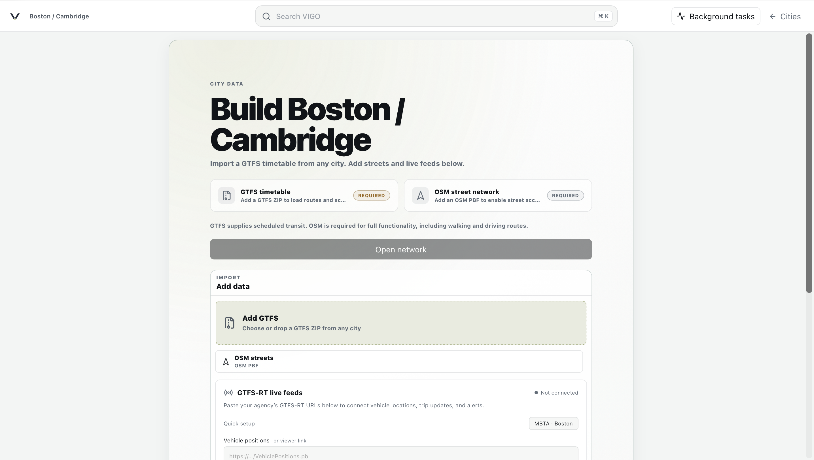

When VIGO Agency starts for the first time, you will be prompted to create or open a city. For the Boston / MBTA example, three data sources are required:

* **GTFS Schedule**: an up-to-date MBTA GTFS feed
* **OpenStreetMap**: a `.osm.pbf` extract covering the Boston region
* **GTFS-Realtime**: MBTA real-time feed (As API endpoints. Select MBTA-Boston in the demo)

Links to the required datasets are provided directly in the application interface.

The first load requires substantial preprocessing. VIGO Agency builds the routing engine, prepares the street network, and indexes the scheduled GTFS data before the city is ready for viewing. For Boston, this typically takes approximately **~5 minutes**, depending on available resources and system workload.

### Network and routes

When a city is opened, VIGO Agency starts on the **Network** page. It combines the static GTFS network with the latest available GTFS-Realtime observations to address **problem 1**.

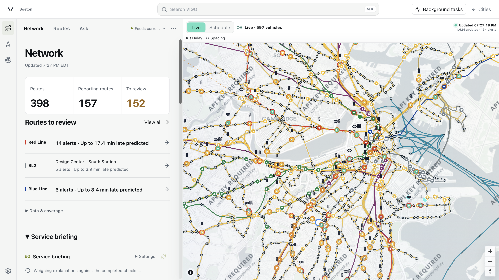

The left panel provides a network summary, including the number of routes with usable real-time information and routes that currently need review, through computed conditions such as delays, cancellations, spacing irregularities, and active alerts.

The map provides the spatial view of the entire network. Static GTFS supplies route geometry and stops; GTFS-RT displays active vehicles. Clicking on a route, vehicle, or stop opens the relevant detail.

#### Service briefing

Further down the Network panel, VIGO Agency generates a **service briefing** from the current GTFS and GTFS-RT state.

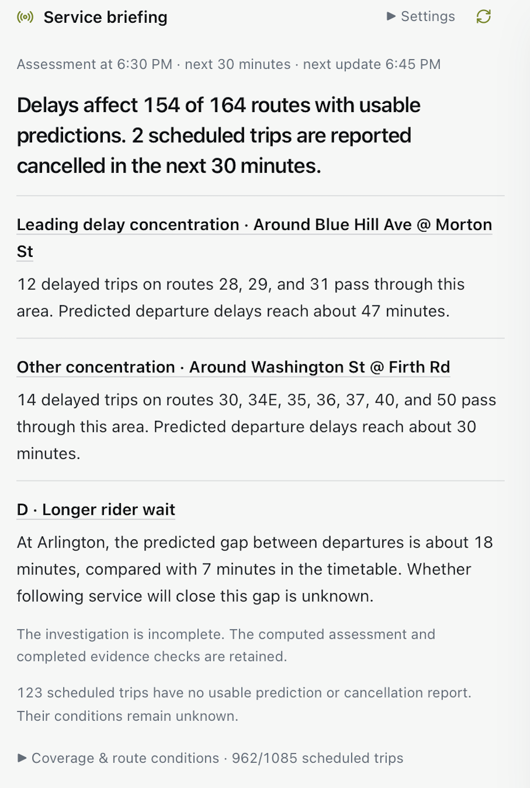

The briefing is based on computed evidence. It can be generated with or without AI automatically every 15 or 30 minutes. Depending on the available feeds, it can report:

- the number of routes and trips with GTFS-RT predictions;
- reported cancellations and alerts;
- geographic concentrations of delayed trips;
- unusual headway irregularity between predicted departures;
- or in the unlikely case, the system performing perfectly (such as late night).

The briefing is purposed as a compact network summary. In a large system such as the MBTA, the raw number of warnings can be high, so individual route and trip views provide the more useful diagnostic layer for operational staff.

#### Delay and spacing diagnostics

The map also exposes individual vehicles and computed service irregularities.

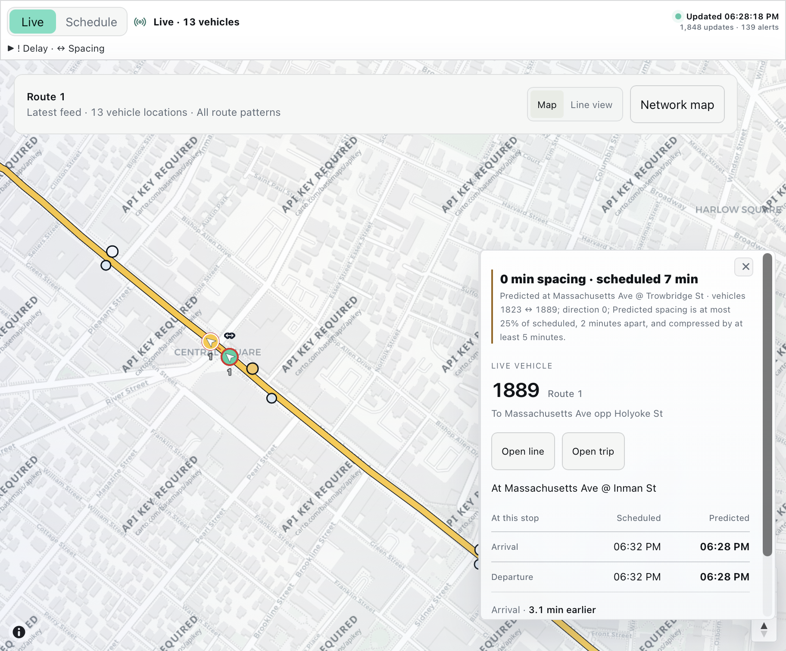

VIGO Agency prototypes two classes of real-time diagnostics through GTFS-RT feeds:

- **Delay (`!`)**: compares GTFS-RT departure predictions against the corresponding static GTFS stop time for the same trip, stop, direction, and service date. **Amber** for warning conditions and **red** for severe conditions.
- **Spacing / Bunching (`↔`)**: compares predicted separation between consecutive vehicles or trips with the scheduled separation. Dashed links identify a chained pair of trips.

#### Stations

Selecting a stop or station opens its departure board.

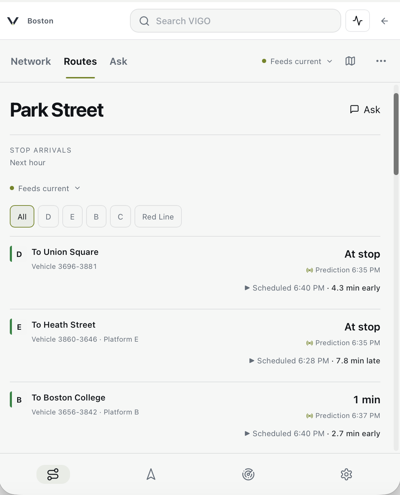

The board joins scheduled GTFS departures with available GTFS-RT predictions and shows the resulting service irregularity, like the departure board in the MBTA station platform. 

#### Route and line views

The **Routes** page provides route-level inspection. A route can be viewed geographically on the map or as a linear stop sequence.

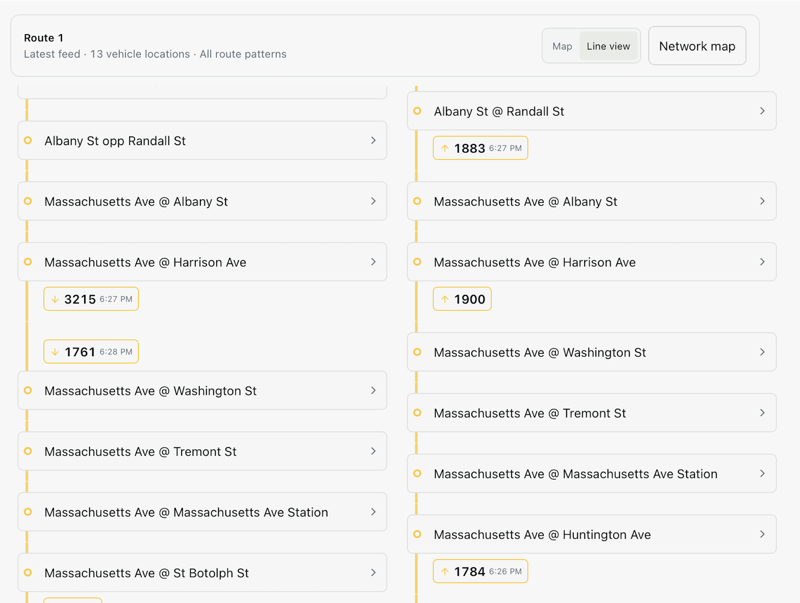

Selecting line view places active vehicles against the corresponding stop sequence in a schematic map, which would be useful for operational staff when the geographic map becomes visually dense. It also suports displaying irregularities as the map.

You may also view individual trips and compare scheduled times against predicted times, stop by stop. It would be helpful for understanding individual delays. A limitation is that current GTFS-RT data only retains predictions for upcoming stops.

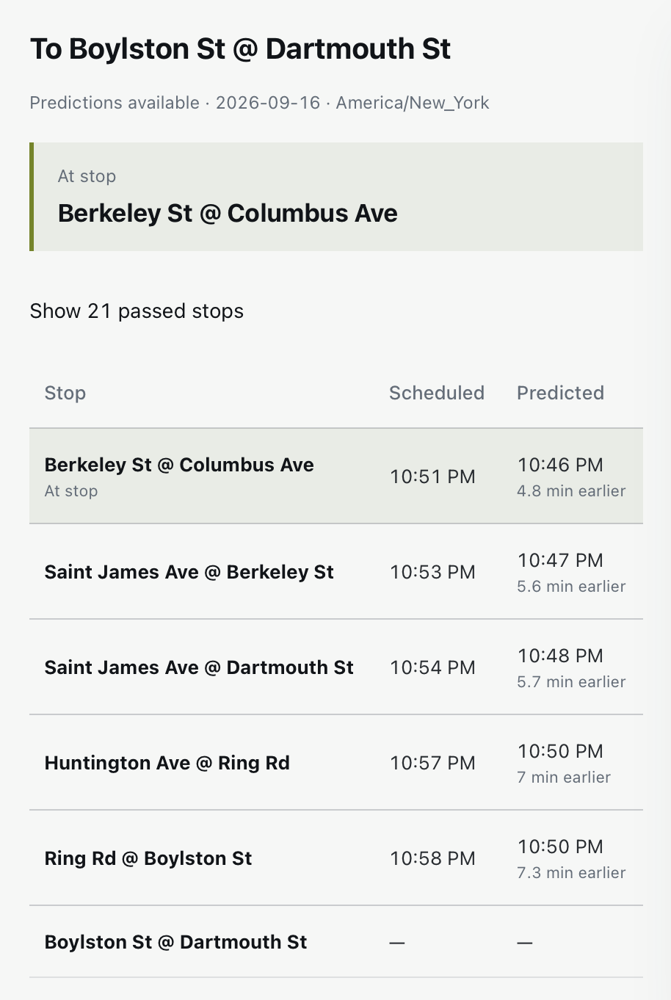

### Ask (Experimental)

To address **problem 2**, VIGO Agency experiments with an agentic interface for querying transit data and computation, similar to **TransitGPT** but with a different philosophy.

**Ask** design deliberately separates **language reasoning from transit computation**. The LLM acts primarily as a **semantic interface and tool orchestrator**. It interprets the request, selects from a bounded set of tools, and supplies structured arguments. Detailed computation are still in deterministic tools and skills outside the model. The rationale is simple: with a smaller model, we make the task closer to multiple-choice than free-response, which reduces opportunities for hallucination.

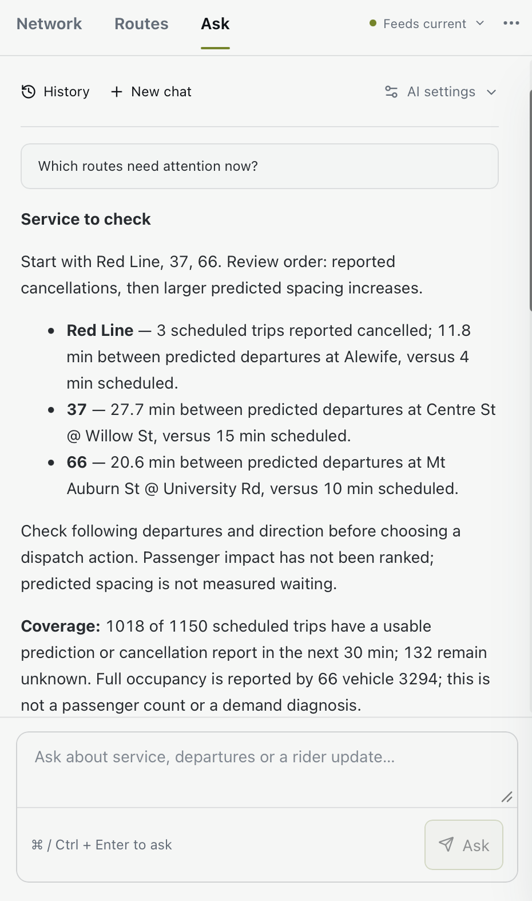

For example, a question “Which routes need attention now?” invokes the real-time network-analysis tools and return computed network status results. The model then organizes that evidence into a natural language response instead of analyzing itself.

#### Configure an LLM

The Ask panel supports configurable model providers or API. On connection, VIGO Agency would verify **tool-calling support**.

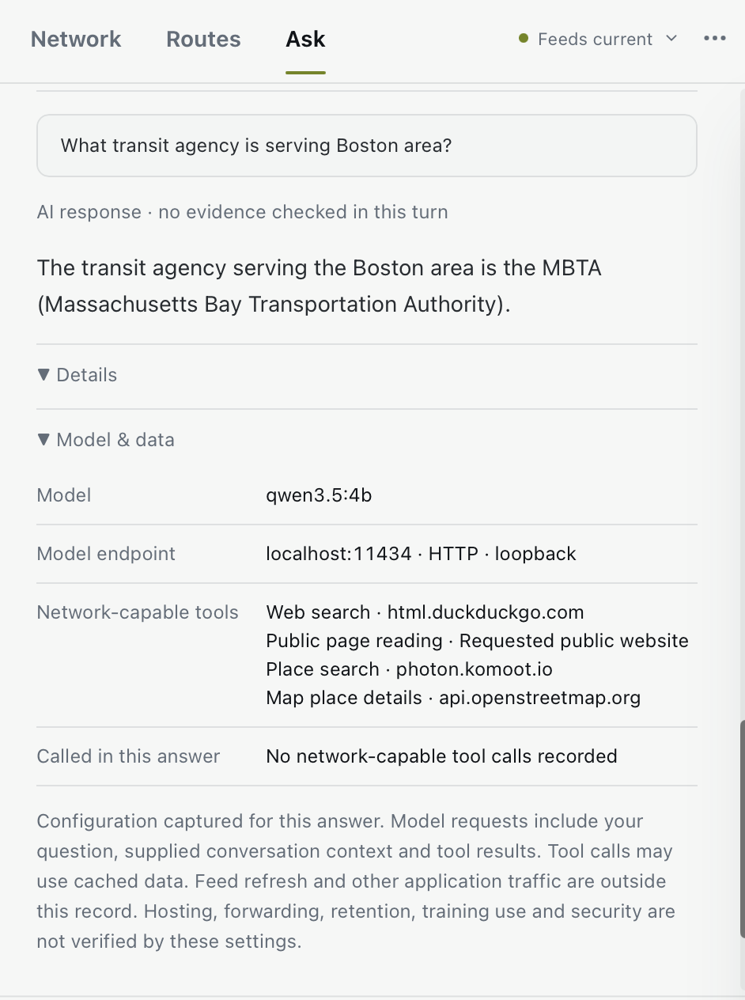

The current execution flow mimics a chain-of-thought query in frontier models:

1. A user submits a natural-language query.
2. The model receives the available tool schemas and current application context.
3. The model selects a tool and generates structured arguments.
4. VIGO validates and executes the corresponding deterministic computation.
5. The tool returns structured results such as routes, stops, and service states.
6. The model may make additional tool calls if necessary.
7. A final response is generated from the completed tool results.

The activity trail exposes intermediate tool execution so that failures are also visible. For example, if a place cannot be resolved from OpenStreetMap, the model would then use a  public-search tool to locate the place online.

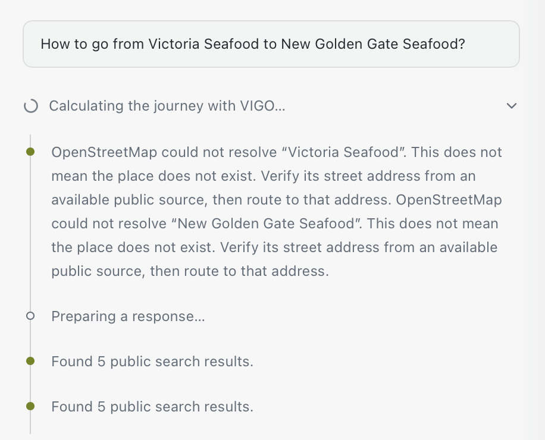

#### VIGO routing and accessibility

Ask is also integrated with the pre-existing capabilities of **VIGO 0.3.2**.

A journey request can resolve locations from online search, call the routing engine, and return the resulting itinerary through the existing map renderer.

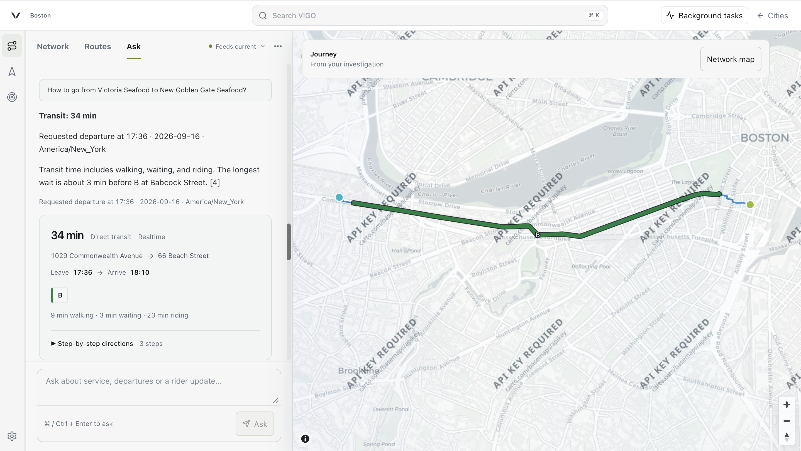

Similarly, Reach requests can call VIGO's one-to-many routing and accessibility engine to compute travel-time surfaces from a selected origin.

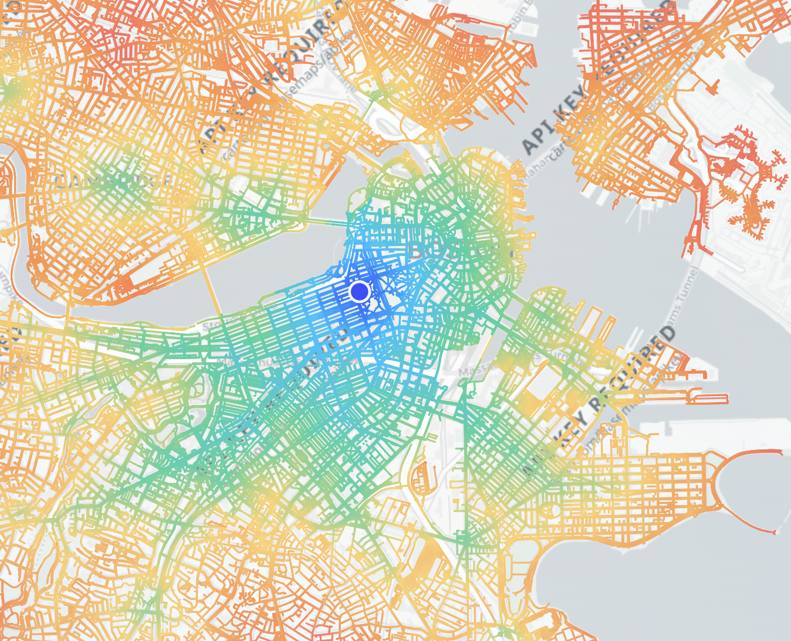

#### Model limitations

**Ask remains experimental.** Tool selection, multi-step reasoning, and final wording depend on the underlying model, so different providers and model sizes may produce materially different behavior or **FAIL** even with the same deterministic tools.

For this evaluation, the primary model is **Qwen3.5:4b running locally through Ollama**. No paid frontier-model API was provisioned for the application, which made a small local model the practical deployment target. You may plug in an OpenAI Compatiable API to test the modeling, which should work to some extent while not guaranteed.

The results are not the performance ceiling of the architecture. There are opportunities since it is working **even when the orchestration model is extremely small (4B)**.

Feel free to play around the platform, and contact me if you encounter any issues or need help testing Ask and LLM configuration.

## Data and resources

VIGO Agency is designed as a largely self-guided platform with public data usage only.

| Resource | Usage |
| --- | --- |
| [MBTA GTFS ZIP](https://cdn.mbta.com/MBTA_GTFS.zip) | MBTA Static GTFS: Feed version “Fall 2026, 2026-09-11T20:42:05+00:00, version D.” Transit timetable.|
| [Vehicle positions](https://cdn.mbta.com/realtime/VehiclePositions.pb), [trip updates](https://cdn.mbta.com/realtime/TripUpdates.pb), [alerts](https://cdn.mbta.com/realtime/Alerts.pb) | Public MBTA observations fetched during this session for GTFS-RT. |
| [OpenStreetMap](https://www.openstreetmap.org) | Basemap and street index built into a PBF format downloaded from BBBike. |
| [VIGO](https://github.com/hytangs/vigo/tree/v0.3.2) | Pre-existing VIGO 0.3.2 platform, and full documentation for the routing engine and untouched features. |

## Compute Resources

Development and primary verification were conducted with OpenAI Codex on **macOS 26.5.1, Apple M2, 8 CPU cores, and 16 GiB unified memory**. The development runtime used Node.js **26.7.0**, npm **11.19.0**, and Electron **44.2.0**.

Runtime AI functionality was tested locally through Ollama using the pre-installed **Qwen3.5:4b** model. No remote compute cluster was used, and no paid remote LLM API was configured for the application, apart from limited API testing through Alibaba-Cloud free tier.

Development used a **ChatGPT Pro 20x** subscription, primarily with **GPT-6 Astra** through Codex for implementation, debugging, code review, and technical assessment.

## Hours Worked

Approximately **18 human-attention hours** were spent on the technical evaluation:

* **3 hours** on system design, problem framing, and implementation planning
* **3 hours** on early stage prompting and goal-based automatic development
* **6 hours** on AI-assisted implementation, debugging, and verification
* **6 hours** on final review and writing documentation

In the AI-Native era, it is commonly understood that model execution time, which may continue unattended for hours or overnight, is excluded.
