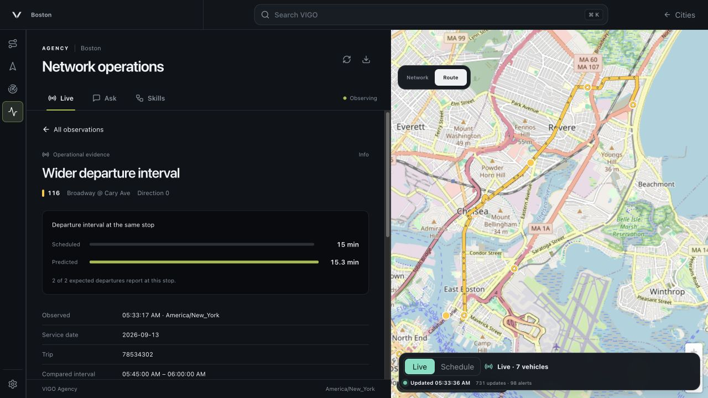
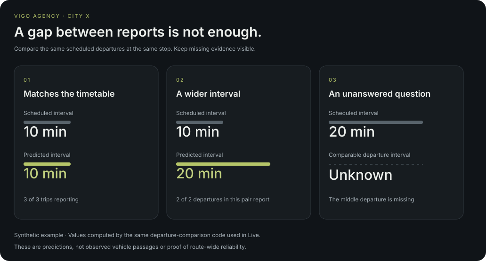

# VIGO Agency

A transit operations workspace for checking what is happening, where it is happening, and what the available data can actually support.

Agency adds a **Network** workspace with **Overview**, **Routes**, and **Ask** to VIGO’s map and routing interface. Open a City, connect its realtime feeds, and investigate a departure, a route, or a journey. Overview brings current observations and routes to review together; Routes supports search, reporting filters, and predicted-delay sorting. Boston supplies the live example; the implementation reads the selected City’s GTFS identities, service calendar, timezone, and street network.

## The problem

A long gap between vehicle reports is not enough to diagnose a service gap. A vehicle may have stopped reporting, the timetable may already specify infrequent service, or the wrong service date may be in use. An operations screen that hides these distinctions gives a confident answer to the wrong question.

This prototype makes the comparison inspectable. Each departure finding identifies the same stop and scheduled trips, records the prediction and schedule side by side, and links back to its sources. It is worthwhile because the same evidence supports three everyday tasks: checking service, investigating a question, and preparing information for riders.

## The artifact

**Live** combines route summaries, independently aged feeds, service alerts, departure comparisons, and a short observation history. Select a finding to see its location, timetable comparison, and source records.

**Ask** lets a model choose bounded transit tools. Its activity trail appears while the checks run. The answer uses readable route and stop names, minutes, and computed results; exact queries remain in expandable details. Journey and Reach results use the existing map. Model setup is in the panel: choose a provider, discover or enter a model, and connect. The connection test checks function calling, not just whether a server responds.

**Skills** provides network health, route triage, and rider-information workflows. These are small built-in compositions, with visible inputs and an enable switch. A reserved headway-control integration is explicitly unavailable. Rider messages are drafts; copying one does not publish it.



*Boston during the development session. The evidence view names the stop and compares predicted departure spacing with the timetable. Map data © OpenStreetMap contributors. Live values change between screenshots and the retained observation below.*

## What the example established

The current MBTA import contains **399 route records**, **10,311 stop records**, and **146,341 scheduled trip records**. Those are feed-wide records, including shuttle routes and station elements; they are not counts of routes or physical stations operating at one moment.

At **05:20:19 EDT on September 13, 2026**, the retained observation contained **75 recent vehicle locations**, **642 matched trip reports**, **7 unmatched reports**, and **74 active alerts**. The three feed clocks were evaluated separately. One route 116 comparison at Broadway @ Cabot St had a **21.75-minute predicted interval versus 14 minutes scheduled**. Both adjacent departures reported at that stop. This is evidence about those predictions, not proof of actual vehicle passages, their cause, or the reliability of the whole route. See the [retained Boston observation](docs/examples/boston-observation.json).

Two useful distinctions emerged during development:

- A retained Boston timetable ended on September 5. Agency required a current import before connecting observations. Importing the current feed was necessary before any live comparison was meaningful.
- The largest absolute interval is not necessarily the largest departure from the schedule. An early Ask result showed 25.1 minutes against 25 scheduled. The interface preserves both numbers instead of labeling the difference a major disruption. Network-wide comparisons can group by route and retain the largest measured interval on each route.

The native adapters also completed an **08:00 scheduled journey from Alewife to Park Street in 22 minutes**, a Matrix query for those endpoints, and a **15-minute Reach from Park Street reaching 114 transit stop records**. These are example outputs, not performance benchmarks. The Route result used scheduled service in that run; Reach and Matrix are explicitly scheduled analyses.

## A small, reproducible City X example



The fixture has three trips, one route, and three stops. In the middle case, the same two scheduled departures are predicted 20 minutes apart rather than 10. In the last case, the middle trip does not report. Agency leaves the comparison unknown instead of treating the gap between reports as a measured service gap. The [computed fixture output](docs/examples/city-x.json) and [figure script](scripts/render-agency-example.mjs) use the production comparison code.

## Methods and limits

The server shares one observation per City across Live, Ask, and Skills. Scheduled-trip alignment uses exact identities, source scope where available, direction, service date, timezone, and calendar exceptions. Ambiguous identities remain unresolved. Headway comparisons require departure predictions at the same stop for adjacent scheduled departures, with both reporting. Arrival predictions and GPS proximity do not substitute for departure times.

Feed freshness is a declared **180-second monitoring policy**. The comparison window and in-memory history are **30 minutes**. Every positive departure delay and unequal measured interval remains numerically visible; no learned anomaly score or arbitrary disruption cutoff is added. These settings describe the prototype’s observation scope, not a transit industry standard.

Ask uses an OpenAI-compatible provider over native fetch. It can select typed helpers and a read-only SQLite query when needed. SQL is limited to approved tables and functions, one statement, at most 200 rows and 256 KB, and a 1.5-second process deadline. Route, Matrix, and Reach call existing VIGO server adapters. A model can choose the wrong investigation, so the executed query and its evidence remain inspectable. Free model prose does not replace computed operational facts.

The scope excludes reconstructed terminal stop calls, frequency-trip instance alignment, multiple agency timezones in one City, translation beyond English, automatic dispatch advice, and automatic publication. There is no learned prediction model or persistent realtime warehouse. Further details are in [ASSUMPTIONS.md](ASSUMPTIONS.md).

## Run it

Requires Node.js **24.18 or later**, npm, and the existing Rust/native build toolchain.

```bash
npm ci
npm run build:rust-routing-kernel
npm run dev
```

Open the local URL printed by the development command. Create a City and import its GTFS ZIP in **City**. Import an OSM PBF to use walking-network Reach. In **Network → Network tools (⋯) → Feed settings**, enter the agency’s feed URLs; MBTA is a convenience preset. In **Network → Ask → Connect AI**, choose a provider, enter its credentials if needed, find a model, and connect. Local Ollama and LM Studio endpoints are supported alongside remote OpenAI-compatible APIs. A model must support function calling. Overview, route browsing, and source evidence remain available without a model.

Keys entered in the interface remain in server memory for the app session. They are not written into the City, repository, or browser storage. Restarting the app requires reconnecting. Server-managed configuration is also available:

```bash
export VIGO_AGENCY_LLM_BASE_URL="https://your-provider.example/v1"
export VIGO_AGENCY_LLM_MODEL="your-model"
export VIGO_AGENCY_LLM_API_KEY="your-key"
npm run dev
```

`VIGO_AGENCY_LLM_REASONING_EFFORT` optionally selects `none`, `low`, `medium`, or `high` where supported. Live and built-in workflows work without a model. Default City storage is `~/Documents/VIGO Agency Cities`; Agency uses its own application configuration directory. `VIGO_PROJECTS_DIR` and `VIGO_CONFIG_DIR` can select an isolated workspace.

```bash
npm run check:agency
npm run typecheck
npm run check:ui
npm run check:security
npm run check:map
npm run check:gtfs
npm run build
npm run package:studio
npm run check:packaged
node scripts/render-agency-example.mjs
```

The desktop package is named **VIGO Agency** and uses its own application identity. Desktop entrypoints (`main.mjs`, `preload.cjs`), icons (`icons/`), web assets, and the built CLI share the `public/` distribution folder. It communicates with its engine in memory. The upstream VIGO checkout and native routing implementation were left unchanged.

## Data and resources

| Resource | Use and provenance |
| --- | --- |
| [MBTA GTFS ZIP](https://cdn.mbta.com/MBTA_GTFS.zip) | Downloaded September 13, 2026. Publisher MBTA; advertised period September 4–December 12, 2026; feed version “Fall 2026, 2026-09-11T20:42:05+00:00, version D.” Imported through VIGO. The full ZIP and generated City are not committed. |
| [Vehicle positions](https://cdn.mbta.com/realtime/VehiclePositions.pb), [trip updates](https://cdn.mbta.com/realtime/TripUpdates.pb), [alerts](https://cdn.mbta.com/realtime/Alerts.pb) | Public MBTA observations fetched during this session. The retained JSON records timestamps and source URLs. They are observations, not a frozen future replay feed. |
| [GTFS Schedule reference](https://gtfs.org/documentation/schedule/reference/) and [GTFS Realtime reference](https://gtfs.org/documentation/realtime/reference/) | Service clocks, calendar exceptions, trip descriptors, departure predictions, and alert semantics. |
| [OpenStreetMap](https://www.openstreetmap.org/copyright) | Basemap and retained Boston pedestrian street index, copied into the isolated demo City without changing the original. The index was built September 10 from a 65,540,060-byte Boston PBF. Its original extract download URL was not retained here, so an independently downloaded extract may give different Reach results. OSM data is available under ODbL. |
| [VIGO](https://github.com/hytangs/vigo/tree/v0.3.2) | Pre-existing application shell, CSS, map, GTFS import, native routing, and Route/Matrix/Reach capabilities. Apache-2.0; see [LICENSE](LICENSE) and [NOTICE](NOTICE). |
| [Ollama OpenAI compatibility](https://docs.ollama.com/api/openai-compatibility) | Provider setup and reasoning controls. Local Chat and VEXTA source were inspected locally for connection and status patterns; their implementations were not copied. |
| [City X fixture](test/fixtures/agency.mjs) | Synthetic test data created for this task. It is not a real agency dataset. |

## Compute

Development and verification ran in Codex on **macOS 26.5.1, Apple M2, 8 CPU cores, 16 GiB unified memory**. The development runtime was Node.js **26.7.0** with npm **11.19.0**; the packaged desktop runtime was Electron **44.2.0**. Native VIGO routing used the local Rust build. No remote compute cluster was used.

The coding assistant was **Codex, identified in the session as GPT-6**. Its subscription/access tier and exact deployment identifier were not exposed, so neither is inferred. Runtime AI was tested with the already-installed **Qwen3.5:4b** model through local Ollama; model discovery, a real function call, a transit question, and a rider draft were exercised. No paid remote inference provider was configured for these tests. These checks establish prototype functionality, not comparative accuracy or superiority to another transit assistant.

This writeup was drafted with AI from the work and retained outputs. [AI-USE.md](AI-USE.md) records authorship, assistance, and the limits of verification.

Time spent: pending final verification.
