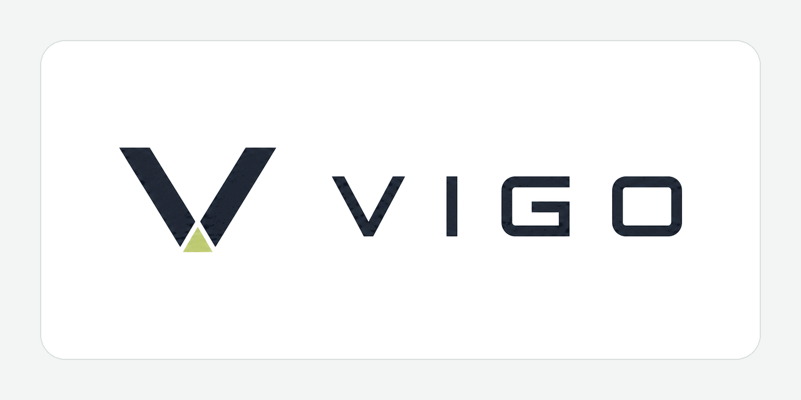

<p align="center">
  
</p>

<p align="center">
  <strong>Build a City. Follow its service. Find a journey.</strong><br>
  <a href="docs/guide.md#vigo-cli-quickstart">Quickstart</a> ·
  <a href="docs/guide.md#vigo-studio-desktop-guide">Studio</a> ·
  <a href="docs/guide.md#build-a-network-answer-a-transport-question">Documentation</a> ·
  <a href="docs/releases/0.5.0.md">Release notes</a>
</p>

VIGO turns GTFS timetables and OpenStreetMap streets into a reusable city model. Inspect live service, plan journeys, calculate travel-time matrices, and compare the reach of proposed service changes. Each computed Result retains its request, City identity, warnings, and timing.

**VIGO 0.5.0** simplifies journey choices, reduces prepared access storage, and opens driving data on demand. See the [release notes](docs/releases/0.5.0.md) and [City rebuild instructions](docs/reference/walking-evidence.md#upgrade-and-check).

VIGO supports multiple GTFS timetables and multiple GTFS-RT endpoints in one City, with explicit source matching, bounded memory admission, and automatic Engine recovery. Native routing powers the desktop and command line. A model connection is optional.

**[Read the documentation](docs/guide.html)** · [Quickstart](docs/guide.md#vigo-cli-quickstart) · [Rust CLI and HTTP](docs/standalone.html) · [Python](https://github.com/hytangs/vigo-py)

## What you can do

| Task | Where to start |
| --- | --- |
| Inspect reporting coverage, alerts, and service briefings | Studio **Network** |
| Follow a route, trip, vehicle, or station board | Studio **Network → Routes**, map and line views |
| Investigate service with a configured model and saved sources | Studio **Network → Ask** |
| Plan a transit, walking, or driving journey | Studio **Route** or `vigo route` |
| Calculate travel times between sets of locations | `vigo matrix` |
| Map travel time from an origin and test planned service | Studio **Analyze** or `vigo reach` |
| Import or remove GTFS and OSM sources | Studio **City → Data sources** |

## Choose an interface

- **VIGO native engine:** one executable for CLI, resident streaming, and a localhost or hosted HTTP service. No Node runtime is required. See [Boston tutorial, Rust query contract, and deployment](docs/guides/rust-standalone.md).
- **VIGO Node CLI:** build Cities from GTFS and OSM, and run queries using the shared native kernel. The [CLI-only archive](docs/guides/cli-only.md) retains routing, matrices, isochrones, scenarios, and resident streaming in two runtime files. Build a City once, then run Route, Matrix, or Reach.
- **VIGO Studio:** a desktop workspace for network inspection, journeys, and scenario analysis. Its project library is separate from CLI City directories.
- **VIGO Python:** automate Engine through the [separate Python package](https://github.com/hytangs/vigo-py).

```text
GTFS + OSM → City → optional Scenario → Route | Matrix | Reach → Result
```

Compare operates on compatible Results. Planned transit changes apply to Reach; supplied traffic applies to Drive Route and Matrix. Realtime transit Route processes supported, matched Trip Updates. Transit Matrix and Reach remain scheduled. See [query support](docs/guide.md#choose-a-supported-combination) and [routing limits](docs/guide.md#known-limits).

## Get started

Download a matching desktop archive from [GitHub Releases](https://github.com/hytangs/vigo/releases), or build from source. Packaged Studio includes its runtime; source builds require Node.js 24.18+, npm 11.6+, and the pinned Rust toolchain with a native linker.

```bash
git clone https://github.com/hytangs/vigo.git
cd vigo
npm ci
npm run build
npm run studio
```

In Studio, create a City and import one or more static GTFS ZIPs and an overlapping OSM PBF. [Match live feeds to their timetables](docs/guide.md#combine-timetables-and-live-feeds) when adding GTFS-Realtime connections for live inspection. A model connection is optional. For a complete command-line example, follow the [quickstart](docs/guide.md#vigo-cli-quickstart).

| Command | Purpose |
| --- | --- |
| `npm run dev` | Browser development with the local engine |
| `npm run build:studio` | Build and package the desktop application |
| `npm run package:cli` | Build the CLI-only archive without Studio or HTTP |
| `npm run check:cli-package` | Verify the extracted CLI and its complete command contracts |
| `npm test` | Public-repository and engine checks |

Native targets are macOS 13.5+ on ARM64/x64, Linux glibc on ARM64/x64, and Windows x64. Linux release builds use Ubuntu 24.04. Studio requires WebGL 2; Engine does not need a graphics device. Packaged Studio communicates with Engine in memory without a local TCP listener.

## Evidence and limits

VIGO is pre-release software. A computed journey is a result within the supplied timetable and street model; a prediction is not an observed passage. Missing reports remain unknown. Reach measures travel time; measuring access to jobs or people requires opportunity data and a stated measure.

Ask sends questions and selected evidence to the configured inference endpoint. Model and web connections are separate. Inspect the answer's sources and **Model & data** record. Ask does not authorize dispatch or publish rider messages. See the [Network guide](docs/guide.md#network-routes-and-ask) and [security policy](SECURITY.md).

## Documentation

For the smallest command-line distribution, see [VIGO CLI](docs/guides/cli-only.md).
For a CLI/HTTP ZIP without Studio or the Python wrapper, see
[Engine packaging and deployment](docs/guide.md#deploy-the-routing-engine).

| Start | Understand | Go deeper |
| --- | --- | --- |
| [CLI quickstart](docs/guide.md#vigo-cli-quickstart) · [Studio](docs/guide.md#vigo-studio-desktop-guide) | [Practical workflows](docs/guide.md#work-with-a-city) · [Read a Result](docs/reference/results.md) | [CLI reference](docs/guide.md#command-line) · [Architecture](docs/developer.md#architecture) |
| [Multiple feeds](docs/guide.md#combine-timetables-and-live-feeds) · [Documentation index](docs/guide.md#build-a-network-answer-a-transport-question) | [Network evidence](docs/guide.md#network-routes-and-ask) · [Troubleshooting](docs/guide.md#troubleshooting-1) | [Contributing and checks](.github/CONTRIBUTING.md) |

The [offline guide](docs/guide.html) includes search, a local Result viewer, and printing. It is generated from the Markdown pages so examples and reference stay in sync.

API 1.0, City format 1, and Result schema 1 remain unchanged in 0.5.0. VIGO is licensed under [Apache-2.0](LICENSE); see [NOTICE](NOTICE) for attribution.

Wheelchair routing is available through a [separately prepared strict profile](docs/guides/rust-standalone.md#wheelchair-routing) for the CLI and API service.
