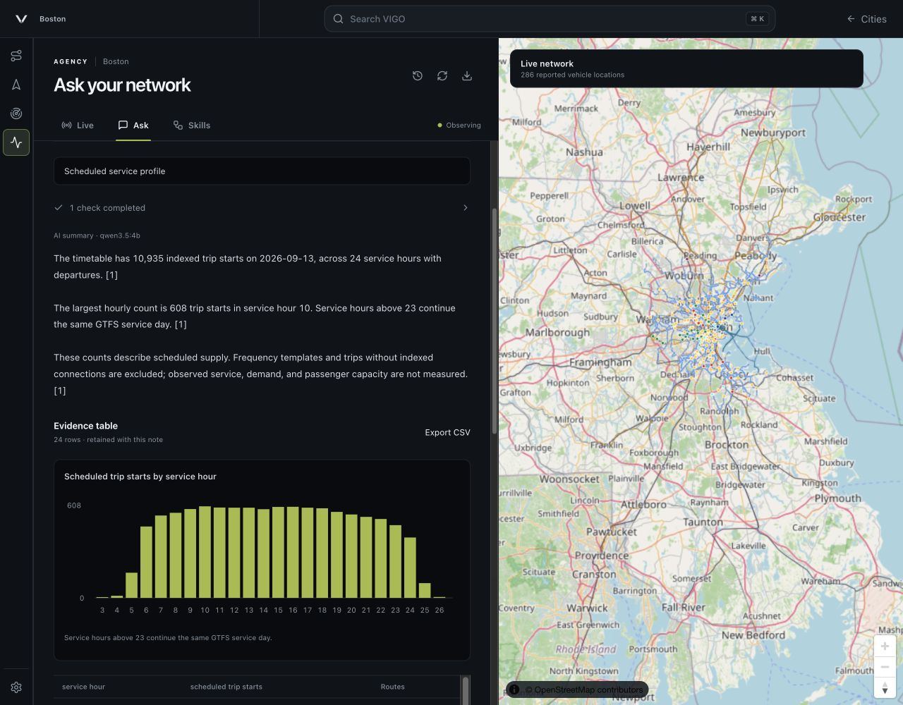
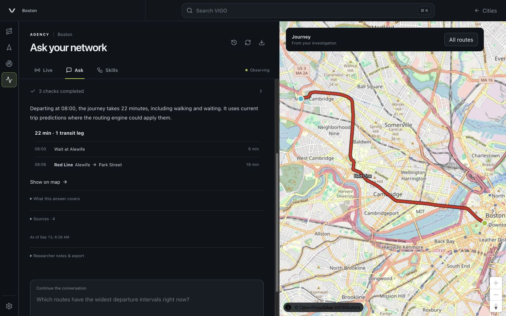

# Agency delivery notes — September 13, 2026

This records the work completed after the request to leave `README.md`, `ASSUMPTIONS.md`, and `AI-USE.md` unchanged. Those three files retain their earlier state. The changes below supersede their descriptions of temporary history and the initial Skills panel.

## Current product scope

The everyday workspace is **Overview → Routes → Ask**. Overview assesses the current network; Routes reuses line diagrams, station departures and service alerts; Ask explains checked service evidence and drafts rider updates. Routing and saved historical studies remain reusable tools when a question needs them.

Research packages and the Service desk/replay prototypes are outside the main workspace. Their source, test fixtures, saved records and APIs remain for research and reproducibility; they are not everyday navigation. Ask does not launch studies or simulate dispatch. Feed settings live in the network menu. Answer metadata is grouped under Details, while failures and timestamps remain visible. These scope decisions supersede the earlier UI descriptions below; retained examples are historical.

## What changed

- **Live opens with a [network briefing](images/agency-briefing.png).** The model chooses relevant facts from the current timetable, departure comparisons, and agency alerts. Every selected fact links to its supporting tool result. The briefing shows its date and time; Update creates another saved snapshot. Realtime polling does not repeatedly invoke the model.
- **Ask keeps the investigation.** Questions, completed checks, answers, sources, and researcher notes are saved in the City's SQLite notebook. Saved work supports search and older entries; opening an investigation restores its conversation and associated map. Follow-up questions retain prior context. Reloading the page or restarting the server preserves saved work.
- **The map follows the work.** A journey shows its route; selecting a departure comparison locates its reference stop. Historical findings retain the values and coordinates that were saved. Table-only studies clear the previous journey. Mobile has an explicit map toggle. The redundant Agency/timezone footer is removed.
- **Skills are executable method packages.** Each package contains a written method, typed inputs, and a bounded sequence of installed transit tools. The four included methods cover network briefing, scheduled supply, departure intervals, and route evidence review. Export a package, adapt its method and tool steps, then use Add skill to install it for the City. Research runs retain their inputs, method, SQL where applicable, and exportable results.
- **Model configuration is in Ask.** Provider selection, model discovery, and a real function-call test are available in the panel. Local endpoints work without an API key. Provider credentials remain on the server for the session. City data and application configuration are separate from the original VIGO installation.

## What the real-data checks found

The scheduled supply method counted **10,935 indexed trip starts** for the MBTA service date **2026-09-13**. There were 24 nonempty service hours, from 03 through 26; the largest count was **608 starts in service hour 10**. Calendar weekday rules and exceptions determine active services. The query uses the first indexed connection of each trip and excludes frequency templates. These are scheduled supply counts, not observed departures, passenger demand, or causal estimates.

The [CSV](examples/boston-service-profile.csv) contains the numeric result. The [retained record](examples/boston-service-profile.json) includes the exact SQL, timestamp, source tables, and exclusions. The [method](../public/agency-skills/service-supply-profile/SKILL.md) states the unit and interpretation.

A natural-language question for Alewife to Park Street on September 13 at 08:00 resolved both stations and called VIGO's native journey planner. The result was **22 minutes**, including six minutes of waiting and a 16-minute Red Line ride. The engine applied eligible current trip reports where possible. During development, the local model initially translated 08:00 into eight minutes after midnight. Ask now passes an explicit clock string, converted once to the native minute input. The incorrect saved run is annotated; the corrected run remains alongside it.

## Data, AI, and limits

The Boston example uses the current [MBTA GTFS ZIP](https://cdn.mbta.com/MBTA_GTFS.zip), public MBTA [vehicle positions](https://cdn.mbta.com/realtime/VehiclePositions.pb), [trip updates](https://cdn.mbta.com/realtime/TripUpdates.pb), and [alerts](https://cdn.mbta.com/realtime/Alerts.pb). The original data provenance remains in the README. Map data is © OpenStreetMap contributors. Boston is an example City; methods read the selected City's identities and calendar.

Codex assisted with implementation, method descriptions, tests, debugging, and this document. Actual inference was tested with the existing local **Qwen3.5 4B** model through Ollama. The model selects tools and verified briefing facts; it does not calculate operational metrics or replace them with free prose. Early free-form summaries misread counts, which led to the explicit fact-selection design. Visible activity shows executed checks and evidence, not private model reasoning.

The notebook is persistent storage for saved investigations and notes, not an autonomous knowledge base or a historical realtime warehouse. Rolling observations still cover 30 minutes. Live feed content can contain producer errors, including outdated alert wording. Saved briefings do not silently change as feeds advance. Cross-provider capability is implemented, but the actual inference demonstration used the local model; this work does not establish comparative quality against TransitGPT.

Compute: macOS 26.5.1 on an Apple M2 with eight CPU cores and 16 GiB memory; Node.js 26.7, Electron 44.2. The coding environment identifies the assistant as GPT-6, but its exact deployment and account access tier were not exposed. The installed local model uses Q4_K_M quantization, about 3.39 GB on disk. One corrected three-tool Ask run took 59.6 seconds; one warm briefing took 5.6 seconds. These single runs are diagnostics, not latency benchmarks.

## Verification and delivery

`npm run check:release` covers the inherited routing, import, security, UI, CLI, runtime, and Agency checks. `npm run build:studio` produces the separate VIGO Agency desktop application; `npm run check:packaged` verifies its packaged engine and City portability. Browser checks covered saved-work restoration, researcher-note persistence, the native journey map, and 320, 390, and 1280 px layouts. Build results and browser observations were checked separately.

The original VIGO 0.3.2 checkout and City were not modified. Agency's native routing core remains inherited. The repository contains source, method packages, small retained outputs, and screenshots; the large GTFS, street index, local model, and generated desktop bundle remain local.

Time spent: approximately 2.7 hours of elapsed agent work.
