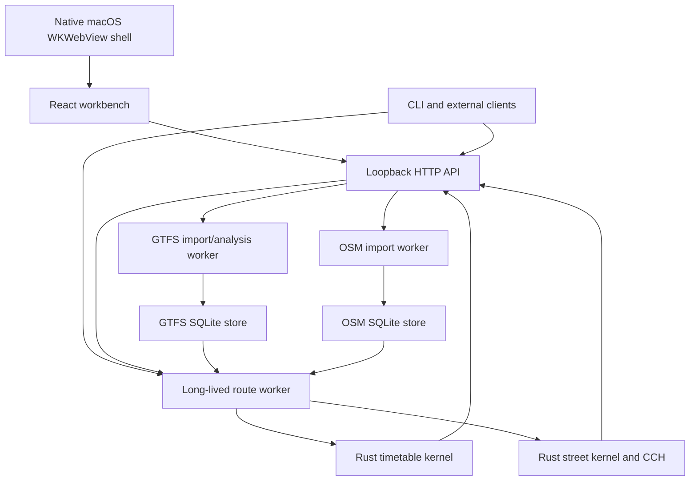

# Development architecture

## Purpose

This page explains how the experimental VIGO codebase is divided across the desktop shell,
web interface, local API, workers, durable stores, and native routing kernels.
For computational semantics, read [Algorithms](../guides/algorithms.md); this
page focuses on software ownership and data flow.

## System overview



All default network services bind to loopback. Static source import, project
storage, routing, and analysis stay local. Remote basemap tiles and optional
GTFS-Realtime retrieval are the principal network-dependent surfaces.

## Product surfaces

The desktop exposes four rail destinations:

- **Network** — inspect GTFS services, stops, patterns, geometry, and lineage.
- **Route** — compute Transit, Walk, and Drive journeys.
- **Evidence** — compute one-origin accessibility and service/policy cases.
- **Manage** — import GTFS/OSM sources and configure local storage/preferences.

Network, Route, and Evidence share the map and project identity.

## Process boundaries

### Native shell

The macOS application is a small WKWebView host. It starts the private bundled
Node.js API, opens the built workbench, exposes native file/folder pickers, and
owns the app-window lifecycle. It does not implement routing.

### React workbench

`src/` owns interaction state, map presentation, request cancellation,
progress, result selection, and evidence disclosure. It never hydrates a
project-scale routing graph or executes a production timetable/street search.

### Local API

`server/vigo-api.mjs` validates loopback requests, project scope, paths, payload
limits, and response envelopes. It coordinates imports, store admission,
readiness, routing leases, and worker lifecycle. Request validation is not
routing ownership.

### Import and analysis workers

GTFS and OSM builds run outside the UI thread. They stream raw sources into
SQLite, validate schema and identities, create indexes, and write rebuildable
native artifacts. Focused GTFS route analysis reads SQLite without changing
routing state.

### Route worker and native kernels

The route worker owns the resident service-date timetable and street context.
Rust owns connection scans, Pareto state, predecessors, arrive-by bounds,
matrices, directed street search, CCH queries, scenario-overlay propagation,
and accessibility surfaces. JavaScript prepares typed requests and materializes
public responses.

## Data lifecycle

```text
raw GTFS ZIP / OSM PBF
        ↓
content identity + validation
        ↓
durable SQLite store
        ↓
source-bound native snapshots and CCH customizations
        ↓
resident worker context for an explicit service date
        ↓
request-local labels, predecessors, exclusions, and scenario overlay
        ↓
public itinerary, matrix, or accessibility envelope
```

Raw inputs and SQLite are durable. Native snapshots are derived and may be
rebuilt. Request-local state is bounded and must not mutate the source store or
leak between generations.

## Store ownership

### GTFS store

The GTFS SQLite store contains normalized source relations, feature inventory,
service-date metadata, analysis indexes, route catalogs, and routing compiler
inputs. It is the durable source for timetable preparation and focused Network
analysis.

### OSM store

The OSM SQLite store contains admitted pedestrian and motor-vehicle profiles,
directed edges, weights, source fingerprint, and preparation metadata. Native
snapshots and contraction hierarchies are identity-bound derivatives.

### Project metadata

The local project record identifies feeds, street store, source paths,
readiness, and user-facing workspace state. It does not replace content hashes
used to identify source data.

## Query dispatch

### Point route

The UI sends one normalized request to `/national-route`. The API joins the
prepared worker operation when necessary, then dispatches the same canonical
route path used by the CLI. The response contains one selected plan plus the
bounded choice set.

### Matrix

The internal/HTTP matrix endpoint uses the resident timetable and returns
scalar rows. The CLI provides the supported public matrix process surface.

### Accessibility and scenarios

`/scenario-analysis` runs baseline and optional case ranges through the same
resident timetable/street owners. JavaScript builds the declarative case and
shapes the comparison; Rust executes access, merged resident/overlay timetable
propagation, connectors, and final street surfaces.

## Interfaces

The supported distribution interfaces are:

- native desktop window;
- loopback HTTP API; and
- JavaScript/native CLI.

The CLI is the canonical non-UI process contract. External bindings may wrap
its versioned JSON and NDJSON schemas, but they are separate projects and must
not introduce an alternate routing algorithm.

## Caches and residency

- Service-date kernels and coordinate-access profiles can remain resident while
  a workspace holds a routing lease.
- Endpoint and complete-result caches are bounded and identity-keyed.
- Derived artifacts are admitted only when source/schema/profile identities
  match.
- Cache hits and preparation are visible in diagnostics.
- Memory pressure, project retirement, or shutdown may evict resident workers;
  the durable stores remain.

Cache presence is an optimization, never correctness evidence or a substitute
for retained source identity.

## Failure and security boundary

VIGO fails closed when required GTFS semantics, street paths, native modules,
or source-bound accelerators are unavailable. The API applies loopback-origin,
path-containment, payload-size, and job-lifecycle controls. A successful local
request does not certify unmodeled GTFS features or make the API suitable for
untrusted public-network exposure.

## Repository map

| Path | Responsibility |
| --- | --- |
| `src/` | React workbench and presentation contracts |
| `server/` | Local API, SQLite stores, workers, orchestration, response shaping |
| `native/vigo-routing-kernel/` | Rust timetable and street computation |
| `scripts/` | Supported builds, packaging, and focused verification |
| `docs/` | Current product and technical contracts |

Generated application output, native binaries, archives, local workspaces, and
private inputs are ignored rather than committed.

## Repository scope

This repository is the VIGO engine and product runtime. It owns the desktop and
web workbench, loopback API, Rust kernels, CLI, import workers, documentation,
packaging, and their tests. It deliberately does not ship Python packages,
notebooks, generated caches, release binaries, publication material, or private
inputs.

External language bindings integrate through the versioned VIGO distribution
contract: CLI command/schema compatibility plus a checksum-pinned runtime
artifact. The core release gate owns that runtime and its CLI contract; a
binding repository owns its own installation, language API, and clean-machine
tests. This keeps the Rust engine independently buildable and prevents a second
router from drifting behind an adapter.

VIGO is licensed under Apache-2.0. The root `NOTICE` and vendored dependency
license files are part of both the source and packaged release boundaries.

## Build and verification lanes

```bash
npm run check:dev
npm run check:public
npm run check:release
npm run release:macos
```

- `check:dev` covers types, UI, map, GTFS, routing, and CLI contracts.
- `check:public` verifies the publication boundary, documentation, and source safety.
- `check:release` adds the extended portable product checks.
- `release:macos` builds, packages, archives, and verifies the macOS artifact.

These lanes are separate claims. A unit or focused contract pass does not imply
a clean release; a packaged app pass does not establish observed operations or
causal validity.

## Extension rules

When adding a new query mode or interface:

1. define its objective, inputs, outputs, and failure states in the routing
   contract;
2. reuse the canonical native owner or explicitly justify a new algorithmic
   boundary;
3. keep process adapters thin and source-identity aware;
4. add independent fixtures for semantics, isolation, and cancellation;
5. separate build/preparation from measured query time; and
6. update support, limitations, and user documentation together.

For deeper contracts, see [Local HTTP API](../local-http-api.md),
[CLI](../vigo-cli.md), [cache and provenance](../cache-provenance.md), and
[support and limitations](../gtfs-support-matrix.md).
