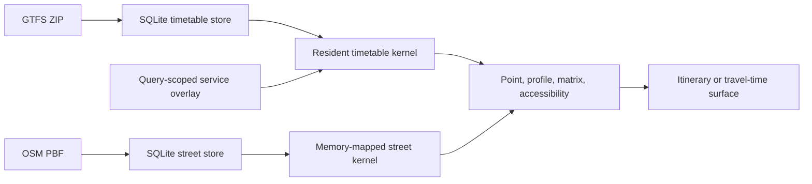

# Algorithms

## Design goals

VIGO's production computation is designed for:

- correct routing within a declared scheduled-GTFS and directed-OSM model;
- low-latency repeated queries after explicit source build and preparation;
- inspectable itineraries and machine-readable failure diagnostics;
- shared ownership across desktop, HTTP, and CLI interfaces;
- one-to-many accessibility without routing every raster cell independently;
- immutable, source-identified preprocessing artifacts; and
- fail-closed behavior when required semantics or accelerators are unavailable.

“Exact” is always conditional on the represented graph, service-day coordinate,
query horizon, candidate access/egress set, and stated objective.

## System model

SQLite is durable compiler/input storage. Production route requests use
resident native arrays and source-bound accelerators rather than scanning
SQLite as a fallback graph engine.

## Timetable compilation

For an explicit service date, VIGO selects active service, validates supported
semantics, and compiles trips into ordered scheduled connections. Each
connection retains departure/arrival times, stop indices, run/trip identity,
sequence, continuity, and pickup/alighting permission.

Transfers are represented as directed edges with declared or normalized
duration. Parent-station relations, pathways, and generic proximity transfers
enter only under the documented support and provenance rules. Unsupported
features remain inventoried and may exclude affected trips or block exact
routing rather than being guessed.

## Point-to-point scheduled routing

The resident Rust timetable kernel uses connection-scan operators over the
active chronological event array.

For the fastest scalar objective, a label records the earliest feasible arrival
and the boarding state needed to respect same-run continuation and transfer
slack. The public fastest contract minimizes arrival time, then boardings at
that arrival.

Balanced choices use a bounded nondominated frontier over arrival/boardings and
evaluate a disclosed product policy after feasible labels are generated. This
frontier is distinct from the fastest theorem. Fare, reliability, and arbitrary
user utility are not hidden dimensions.

Predecessor state is retained only where an itinerary must be reconstructed.
Matrix and accessibility operators return scalar fields and avoid paying the
memory cost of a witness for every destination.

## Depart-at, arrive-by, and departure profiles

### Depart-at

A fixed departure runs the forward operator once. Access walking determines
when each origin candidate is ready; the scan propagates feasible scheduled
rides, transfers, and terminal egress.

### Arrive-by

One-to-one arrive-by uses a reverse bound to identify candidate first boardings,
then runs the ordinary forward feasibility path. The returned itinerary is
therefore replayable in chronological order. Arrive-by matrices are not
implemented.

### Departure profiles

The desktop's **Later departures** option samples a finite forward window at
one-minute increments. Reuse is allowed only while the same first boarding
remains feasible. Every retained sample still has fixed-departure semantics; no
continuous or stochastic headway profile is implied.

## Street routing and endpoint attachment

The GTFS and street graphs remain separate. Coordinate Transit attaches an
origin and destination to a bounded, component-aware directed pedestrian
frontier; exact-stop Transit bypasses coordinate attachment. Standalone Walk
and Drive retain their own declared attachment policies.

Walk uses a distance-customized contraction hierarchy over the pedestrian
profile. Drive uses one contraction-hierarchy structure with time and distance
customizations:

1. the fastest witness is final when it satisfies the distance ceiling;
2. the shortest-distance optimum can certify infeasibility; and
3. only the unresolved feasible case enters an exact nondominated
   `(time, distance)` fallback.

Free-flow edge times are the default Drive metric. A fresh normalized traffic
snapshot may slow or close directed input edges; VIGO re-customizes the time
metric while retaining the same contraction order, distance metric, and exact
distance-constrained decision sequence.

All connector distance is charged. A disconnected or directionally blocked OSM
path does not become a straight-line route.

## One-to-many and matrix routing

Forward one-to-many and many-to-many queries share the resident timetable and
return scalar travel-time rows. Shared and pairwise strategies must agree under
the same prepared endpoint candidates, fastest objective, service-cycle policy,
horizon, and terminal-egress rule.

The public matrix contract caps a request at 50,000 origin-destination pairs.
The dedicated Accessibility range operator has a different target contract and
does not inherit that public matrix cap.

## Accessibility range

For one origin, VIGO:

1. computes the directed origin access frontier;
2. selects every timetable stop capable of seeding the requested output;
3. scans the resident timetable once with generation-tagged exclusions;
4. combines the origin and reached-stop seeds; and
5. propagates one directed multi-source OSM surface onto the raster.

The target envelope is proven by a great-circle lower bound using display
radius plus terminal walk budget. It limits returned stops, not timetable
propagation. Raster cells receive the best settled street arrival, with
arrival time interpolated only along reachable directed OSM edges. Empty
space is left as no-data rather than filled by straight-line extrapolation.

The final street surface retains nondominated `(absolute time, distance walked
from this seed)` labels. An earlier seed that has exhausted its walking resource
does not dominate a later seed with more remaining distance.

## Query-scoped service overlays

Scenario services are flattened into finite connection arrays and merged with
resident connections in chronological order inside the same timetable kernel.
Directed OSM connectors join resident and scenario stops. The combined scan can
move baseline → scenario → baseline or between scenario services.

The resident timetable and base SQLite store remain immutable. Route exclusions
and temporary labels use query generations, so scenario state cannot leak into
the next request.

## Preprocessing and caches

GTFS and OSM imports produce content-identified SQLite stores. Derived native
artifacts include active timetable images, endpoint-access profiles, and
pedestrian/drive contraction-hierarchy snapshots. Each artifact is admitted
only when its source identity, schema, profile, and counts match.

Resident workers and bounded caches amortize preparation across requests. A
cache hit is observable and is never reported as an uncached graph-search
measurement. Partial or incompatible artifacts fail closed and must be rebuilt
from the durable source store or raw input.

## Correctness invariants

Production and fixture checks enforce, among other properties:

- chronological feasibility and service-calendar validity;
- pickup, alighting, continuation, and boarding-slack rules;
- directed transfer and street reachability;
- stable itinerary reconstruction from native predecessor state;
- scalar/shared/pairwise matrix agreement under a common policy;
- isolation of exclusions and scenario state between queries;
- differential agreement with small independent fixture references;
- stable result checksums across cold-to-warm replay; and
- explicit unsupported, blocked, or rebuild states.

Passing these checks establishes the tested contract, not universal GTFS
correctness or real-world behavioral validity.

## Complexity and performance interpretation

The timetable scan is linear in the portion of the ordered connection array
visited plus relaxed transfers, while resident preparation and candidate access
are separate costs. Contraction hierarchies shift work into source-bound
preprocessing so repeated street queries visit a much smaller search graph.

Asymptotic language alone is insufficient for user-facing performance. VIGO
therefore reports source build, preparation, graph loading, native search,
end-to-end request, cache state, memory, and result agreement separately.

## Implementation map

- `server/national-gtfs-store.mjs` — GTFS storage, compilation, request policy,
  and public materialization.
- `server/national-osm-store.mjs` — OSM storage, native artifact lifecycle, and
  street preparation.
- `server/native-routing-kernel.mjs` — JavaScript/Node-API validation boundary.
- `native/vigo-routing-kernel/src/timetable.rs` — resident timetable operators.
- `native/vigo-routing-kernel/src/exact_routing.rs` — exact route primitives.
- `native/vigo-routing-kernel/src/street_analysis.rs` — native street analysis.
- `server/scenario-analysis.mjs` — baseline/case orchestration and response
  shaping, not a shadow router.

For normative detail, see the [routing contract](../routing-contract.md),
[street routing](../street-routing.md), and
[Accessibility architecture](../scenario-analysis-architecture.md).
