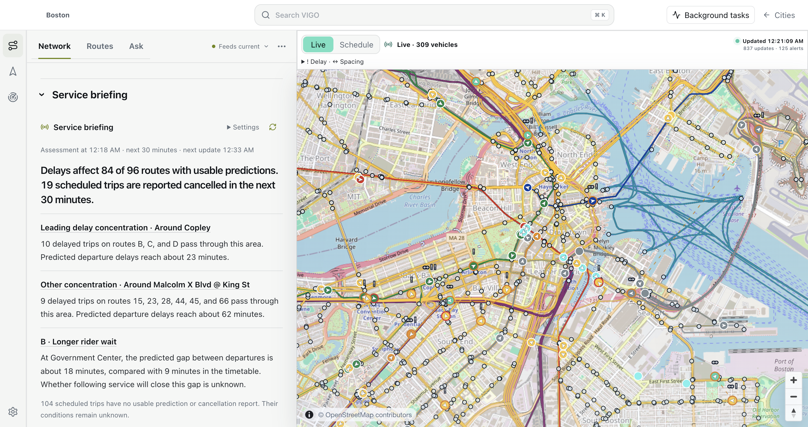
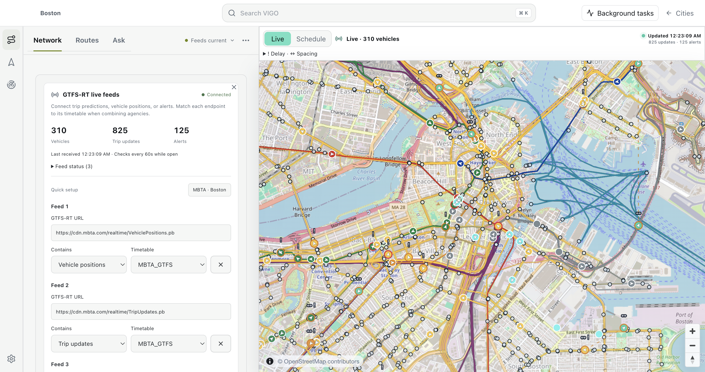
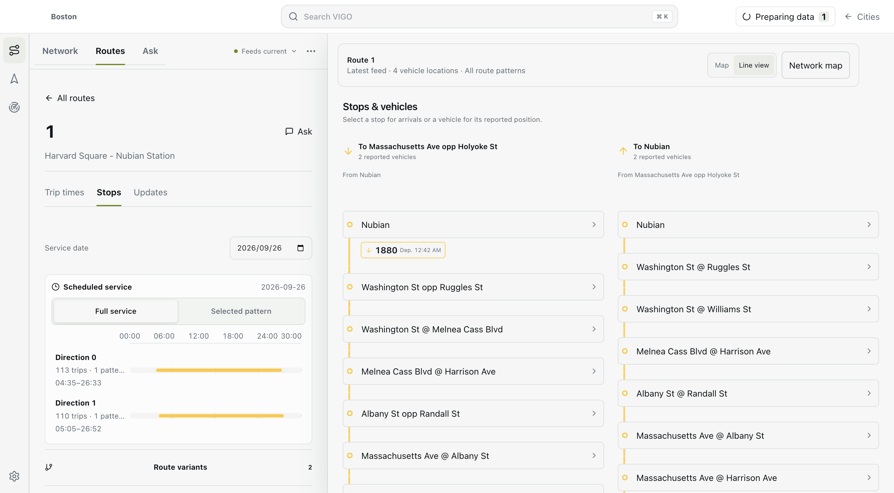

# Studio in use

These images are captures of the running VIGO 0.4.2 desktop application on macOS ARM64. They use a newly imported public MBTA timetable and a small downtown Boston OpenStreetMap extract. Data and observations were downloaded on **26 September 2026**. They are not composed interface illustrations.

## Inspect a network

Open **Network** for source coverage and reported service, then **Routes** to examine a line, its trips and stops. A timetable-only view labels estimated vehicle positions separately from live reports.

## Connect live sources

Open **City → Data sources**, or **Network → Feed settings**. Add endpoints individually and select the matching timetable. Vehicle positions, trip predictions and alerts can refresh independently.

## Examine a route

Choose **Routes**, select a service, and inspect its actual imported stop pattern. The interface keeps scheduled service and reported observations visible as different sources of evidence.

## Reproduce the captures

1. Build and start Studio with the [quickstart](quickstart.md).
2. Create an empty Boston City and import the [MBTA GTFS ZIP](https://cdn.mbta.com/MBTA_GTFS.zip).
3. For this capture, the OSM source was the public [downtown map extract](https://api.openstreetmap.org/api/0.6/map?bbox=-71.067,42.353,-71.056,42.362), converted from OSM XML to PBF with `osmium cat`. It covers only the stated rectangle; it is not Boston-wide street coverage.
4. In live-feed settings, choose the MBTA preset and connect its three official endpoints.
5. Open Network, source settings and a route. Capture the application window after data and map tiles finish loading.

The live endpoints are [Vehicle Positions](https://cdn.mbta.com/realtime/VehiclePositions.pb), [Trip Updates](https://cdn.mbta.com/realtime/TripUpdates.pb), and [Alerts](https://cdn.mbta.com/realtime/Alerts.pb). Later captures will differ as service and feeds change. Screenshots document UI behavior and source integration; they are not performance benchmarks or evidence of accurate arrival predictions.

Timetable and live data: MBTA. Map data: © [OpenStreetMap contributors](https://www.openstreetmap.org/copyright). The original attribution remains visible in map captures. The README uses the repository's existing GitHub social image as its visual identity.
