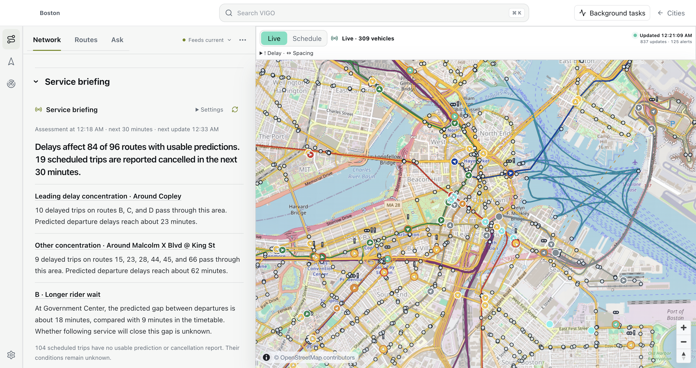
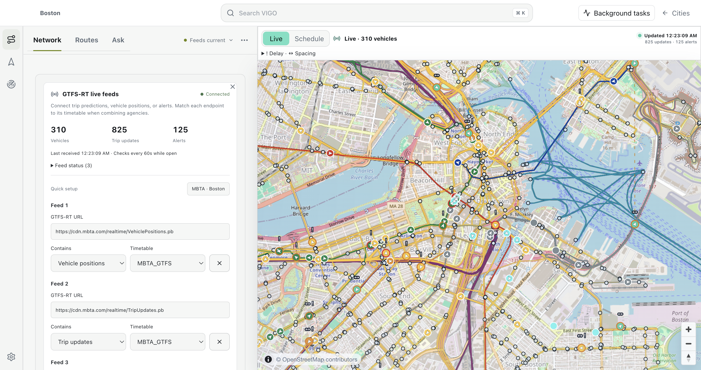
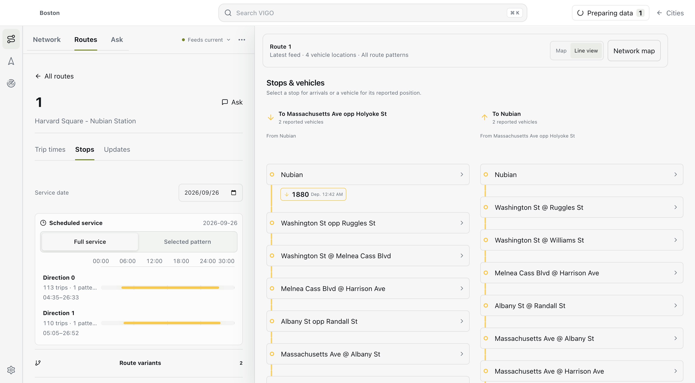

# Historical records

Dated release and validation records are retained below. They are not current-release instructions.

## Studio in use

These images are captures of the running VIGO 0.4.2 desktop application on macOS ARM64. They use a newly imported public MBTA timetable and a small downtown Boston OpenStreetMap extract. Data and observations were downloaded on **26 September 2026**. They are not composed interface illustrations.

### Inspect a network

Open **Network** for source coverage and reported service, then **Routes** to examine a line, its trips and stops. A timetable-only view labels estimated vehicle positions separately from live reports.

### Connect live sources

Open **City → Data sources**, or **Network → Feed settings**. Add endpoints individually and select the matching timetable. Vehicle positions, trip predictions and alerts can refresh independently.

### Examine a route

Choose **Routes**, select a service, and inspect its actual imported stop pattern. The interface keeps scheduled service and reported observations visible as different sources of evidence.

### Reproduce the captures

1. Build and start Studio with the [quickstart](guide.md#vigo-cli-quickstart).
2. Create an empty Boston City and import the [MBTA GTFS ZIP](https://cdn.mbta.com/MBTA_GTFS.zip).
3. For this capture, the OSM source was the public [downtown map extract](https://api.openstreetmap.org/api/0.6/map?bbox=-71.067,42.353,-71.056,42.362), converted from OSM XML to PBF with `osmium cat`. It covers only the stated rectangle; it is not Boston-wide street coverage.
4. In live-feed settings, choose the MBTA preset and connect its three official endpoints.
5. Open Network, source settings and a route. Capture the application window after data and map tiles finish loading.

The live endpoints are [Vehicle Positions](https://cdn.mbta.com/realtime/VehiclePositions.pb), [Trip Updates](https://cdn.mbta.com/realtime/TripUpdates.pb), and [Alerts](https://cdn.mbta.com/realtime/Alerts.pb). Later captures will differ as service and feeds change. Screenshots document UI behavior and source integration; they are not performance benchmarks or evidence of accurate arrival predictions.

Timetable and live data: MBTA. Map data: © [OpenStreetMap contributors](https://www.openstreetmap.org/copyright). The original attribution remains visible in map captures. The README uses the repository's existing GitHub social image as its visual identity.

## Architecture audit for 0.4.2

This records the final local VIGO 0.4.2 freeze, including the runtime hardening
and multi-feed follow-up. The user-authorized retag replaces the earlier local
freeze. [Realtime and traffic methods](#realtime-and-traffic-method-audit--042) and
[runtime limits and recovery](developer.md#runtime-limits-and-recovery) document current behavior.

This review covers the Engine and Studio repository: import and City storage,
native adapters and kernels, worker scheduling, CLI and HTTP boundaries, React
and map surfaces, agency research interfaces, documentation, and release checks.
The Python wrapper, private comparisons, and manuscript are separate repositories
and are outside this freeze. API 1.0, City format 1, and Result schema 1 remain
unchanged.

The audit combines source inspection, repository-wide export/reference and
duplicate-block scans, and the repository's regression suites. Static scans are
candidates for investigation, not proof that every runtime path is reachable or
that all defects have been found. The initial architecture review did not run a
comparative benchmark. Follow-up performance changes preserve the routing
contract; [performance measurement](developer.md#measuring-performance) defines the evidence needed
for a workload-specific speed claim.

### Repairs included in the freeze

| Finding | Consequence | Repair and regression |
| --- | --- | --- |
| Worker message transfer could throw after setting the active job | An immediately rejected request left the worker busy; a queued failure could escape from the completion handler | Catch transfer failure, clean cancellation listeners, reject that job, and continue the queue without restarting the prepared worker. `check-national-runtime-isolation.mjs` uses actual workers to check clone failure, capacity, shutdown and recovery. |
| A timetable retained a string-keyed map of every street identity/access-profile projection used with it | Repeated policy changes could accumulate full stop-mapping arrays for the timetable's lifetime | Weak keys for both owners, with one current profile per pair. `check-stop-projection.mjs` covers reuse, 100 replacements, return to an earlier profile, unknown stops, and distinct owners. |
| Release checks verified package versions but not the CI tag name | A differently named tag could package and publish the wrong declared version | Tagged CI runs require `v` followed by the package version. |
| Engine failures could reject a desktop protocol handler without an explicit response | Unavailable-engine requests depended on Electron's rejection handling | Return a structured 503; the actual-process recovery check verifies this response after exhausting the restart budget. |
| Matrix reference used implementation vocabulary for returned journeys | Readers needed algorithm context to interpret ordinary output | Replace witness/materialization wording with journey/assembly where equivalent; define necessary algorithm terms in the architecture guide. |
| Selected-journey geometry copied or traversed more shape data than the returned segment needed | Assembly could dominate the native timetable query | Load numeric shape buffers natively, prune exact alignment candidates, bound range sampling and combine geometry cleanup/distance work. Native materialization and route-geometry checks preserve sampling and route outputs. |
| Numeric whole-unit fare parsing initialized localized currency formatting | The first fare-bearing response paid a presentation setup cost after the inner route timer ended | Use a conservative exact-integer fast path; retain currency-specific validation for fractional and large amounts. The fare suite checks every runtime-supported currency and integration with imported catalogs. |

Runtime and projection regressions run in `check:national-runtime`, included in
`check:release`. Existing Route/Matrix and lifecycle suites check the integrated
behavior. Cache eviction changes preparation reuse, not routing objectives.

### Remaining cost centers

These are mechanisms visible in code, not ranked measurements of production
latency. Use the [timing boundaries](developer.md#measuring-performance) before making speed claims.

| Layer and source | Cost or constraint | Decision for this freeze |
| --- | --- | --- |
| City compilation and GTFS coordinator: `src/server/national-gtfs-store.mjs` | Import, source validation, transfer construction, and active-service preparation remain substantial first-use work | Preserve atomic publication and identity checks; separate Build, reopen, and resident measurements. |
| Street preparation: `src/server/national-osm-store.mjs`, `native-routing-kernel.mjs` | Opening validates graph arrays and required indexes; older ephemeral Drive Cities rebuild the hierarchy | Retain validation; new City builds already persist Drive structures. Rebuild older Cities when persisted preparation is needed. |
| Worker pool: `src/server/runtime/route-worker-pool.mjs` | Synchronous native work serializes jobs within a worker; cancellation can eventually require a restart and renewed preparation | Preserve bounded cancellation and memory-pressure behavior. Increasing worker count can multiply graph/timetable memory. |
| Timetable kernel: `native/vigo-routing-kernel/src/timetable.rs` | Shared scans reduce repeated search, but boarding-cap states and optional journey reconstruction still consume work and memory | Preserve exact objectives and directed access. Large shared forward/reverse fixtures validate semantics, not universal throughput. |
| Matrix output: `src/server/national-gtfs-store.mjs`, `src/cli/vigo.ts` | Dense results require one row per pair; optional geometry adds work even when search is shared | Prefer scalar output when legs/geometry are unnecessary. Serialization belongs in caller latency measurements. |
| Selected-journey assembly: `src/server/national-gtfs-store.mjs`, `src/server/gtfs/route-results.mjs` | Native shape loading and alignment still leave selected-row lookup, range sampling and itinerary-object assembly | Retain the explicit boundary; native search timing alone excludes this work. Fare annotation also occurs outside the inner route timer. |
| Realtime: `src/server/gtfs/realtime-timetable.mjs` | A changed or newly invalid snapshot requires reconstruction and indexing | Preserve captured-clock validity and scheduled isolation; measure unchanged and changed snapshots separately. |
| Renderer and map: `src/App.tsx`, `src/VigoMap.tsx`, `src/map/` | Large feature replacement, geometry decoding, and render effects can dominate visible response | Retain lazy decoding and serialized source updates; interaction checks cover refresh isolation and small layouts. |

### Follow-up repairs

Studio now connects multiple GTFS-RT endpoints and retains the selected static
source on every record. Stop-specific delay no longer propagates backward.
Unknown relationships, unordered stop sequences and oversized snapshots are
rejected. Individual source failures remain visible through routing coverage.
The [method audit](#realtime-and-traffic-method-audit--042) records the complete findings.

Downloads, decoding, reconstructed timetables, worker queues and restart attempts
have finite limits. The actual-process recovery checks replace substituted
workers and clocks. No native search or provider response is fabricated.

### Cleanup decisions

The initial exported-symbol scan found no single-occurrence exported function, class,
or constant candidates across tracked source, tests, scripts, and public entry
points. The initial exact normalized 12-line block scan found no cross-file duplicate
blocks above its 380-character threshold in source. These limited checks do not
detect every unused path or semantic duplicate. TypeScript already enforces
unused locals and parameters.

Do not remove the LAMP saved-study reader, replay inputs, model-history filters,
or old City compatibility solely because their names look historical. They have
retained readers, runtime consumers, or explicit format behavior. Vendored CCH
code and its notices remain a separately maintained dependency.

The large GTFS coordinator, API entry point, App component, and native kernels
remain maintenance risks. Extract future modules by ownership of store identity,
cache lifetime, request state, or search workspace. A line-count-driven split at
the freeze would move complexity without proving a behavior improvement.

The follow-up removed 26 redundant test/fixture files and over 6,000 net lines
of simulated infrastructure before this final pass. This pass also removes the
duplicate URL parser and an enum test loop that mirrored the lookup itself,
while extending real multi-source integration and vehicle identity checks.
Scratch imports, captures, temporary profiles, logs and superseded archives are
removed after verification. Final screenshots and their public source provenance
remain in documentation; the final distributable remains under `release/`.

### Freeze verification

Run `npm run check:release`, `npm run check:studio-runtime`, Rust tests and
Clippy, then `npm run release:studio` on the target host. Build the printable
guide with `npm run docs:developer-guide`. The release check also verifies source
publication boundaries and version consistency. Generated binaries, test logs,
and archives stay outside tracked source.

A local tag identifies the reviewed source revision. It does not establish
foreign-platform validation, remote publication, signed provenance, live feed
accuracy, or performance on an untested City. The release workflow performs the
supported-platform builds and attestation when dispatched or triggered remotely.

The initial local freeze on 26 September 2026 on macOS ARM64 passed the full release suite, Studio
interaction suite, all 16 Rust tests, Clippy with warnings denied, and the
Studio build/package/isolated-runtime/archive checks. The printable guide
compiled to 10 pages. Source checks ran on Node 26.7.0, which satisfies the
declared minimum; the CI configuration pins Node 24.18.0 and was not rerun
remotely in this audit. Matching-tag acceptance and mismatched-tag rejection
were both exercised. Other operating systems and CPU targets remain unverified
by this local run.

The itinerary and fare follow-up reran the full release suite, Studio interaction
suite, production build, all 16 Rust tests, and Clippy with warnings denied.
Recovery verification now consumes each health response before deliberately
killing its Engine. After initial recovery-test timeouts, the complete Studio
suite and three further fresh-process recovery checks passed with that cleanup;
production recovery behavior was not changed. The initial timeout cause was
not independently isolated.

## Realtime and traffic method audit · 0.4.2

This audit covers supported routing behavior in Engine and Studio. It is software verification, not a paper result, a live ETA calibration, or a claim about dispatch outcomes. No traffic provider was configured for this release.

### What a realtime answer means

A transit query resolves records against an active static trip and service day, applies accepted predictions to a separate timetable, then runs native search and journey reconstruction. Unreported trips retain scheduled times. The answer can therefore contain a mixture of predictions and schedule-based legs. `routingDataMode: "realtime"` alone does not establish that a prediction was used.

The audit follows the primary [GTFS-Realtime reference](https://gtfs.org/documentation/realtime/reference/) and [producer best practices](https://gtfs.org/documentation/realtime/realtime-best-practices/). These specifications define feed semantics; they do not certify VIGO's implementation or an individual producer's accuracy.

### Findings and repairs

| Finding | Repair | Verification |
| --- | --- | --- |
| Studio accepted one group of URLs and omitted static source identity during normalization | Explicit endpoint list, timetable selection, source metadata on every record, and one shared URL normalization boundary | Two imported GTFS feeds with identical trip IDs, actual protobuf over HTTP, native forward/reverse queries |
| A first stop-level delay could be copied into the trip-wide delay | Preserve only the actual TripUpdate delay at trip level; stop predictions propagate forward from their own calls | A downstream prediction leaves origin boarding unchanged; separate literal-timetable comparisons |
| Unknown enum values could disappear and become the default scheduled relationship | Retain `UNKNOWN` and reject unsupported routing relationships | Decoder/normalization and routing admission checks |
| Unordered stop sequences were accepted through lookup maps | Reject non-increasing reported sequences | Timing admission regression |
| Successful records could appear fully admitted while another endpoint failed | Preserve individual feed errors and expose `failedFeeds`; complete coverage remains false | Combined successful and rejected FULL_DATASET/DIFFERENTIAL input |
| Retained observations could outlive their timetable revision | Save the timetable identity and discard obsolete active snapshots when it changes; retain the connection for a fresh fetch | City lifecycle and operational persistence checks |
| Vehicle cards indexed raw trip IDs across feeds | Match source scope and trip instance; duplicate prediction reports remain unresolved | Two source scopes sharing route/trip IDs in the actual vehicle-frame builder |
| More endpoints could multiply retained payloads | Bound sockets, refresh duration, bytes, entities and stop predictions; reject excess input explicitly | Production bounded-reader/security tests and multi-feed integration |
| Native realtime reconstruction could allocate beside an already resident scheduled view | Check a conservative reconstruction estimate against the same finite timetable budget before native compilation | Native reconstruction regressions and low-budget runtime admission checks |

The existing separate worker and Engine recovery checks use actual thread/process termination and subsequent real routing. They do not claim recovery from every native hang or operating-system out-of-memory condition. See [runtime limits](developer.md#runtime-limits-and-recovery).

### Semantic checks retained

| Question | Implemented rule |
| --- | --- |
| Can one agency's `trip_id` change another? | Only an exact or uniquely resolved source identity can match; contradictory scope, route and direction are excluded |
| Can a missing report establish on-time service? | No. Scheduled fallback is disclosed; supplied-update coverage is separate from all-service reporting coverage |
| Can an old cached snapshot stay live? | No. Feed and record clocks are rechecked; expiry changes cache identity |
| Can predictions travel backward along the trip? | No. Stop-specific delay propagates downstream; absolute time wins over delay; arrival/departure remain separate |
| Can an update make a journey run backward in time? | Contradictory event order and native numeric overflow are rejected |
| Can a canceled or deleted trip reappear through fallback? | Removed trips stay removed in both search directions; cancellation does not authorize a different service date |
| Can skipped stops still be boarded? | No. Through travel remains possible; boarding and alighting are removed |
| Does `NO_DATA` continue a prior delay? | No. It resets propagated delay |
| Do route endpoints restrict which predictions get applied? | No. All admitted supplied updates participate in the rebuilt timetable |
| Are prediction uncertainty fields confidence intervals? | No. Routing uses point predictions; it does not infer a calibrated probability or arrival interval |

FULL_DATASET is supported. Entity deletion markers that require a differential stream are rejected; trip cancellations remain distinct. DIFFERENTIAL and unknown incrementality are rejected. NEW/ADDED, replacement, duplicated and frequency-instance routing remain outside the supported contract; some added service can be displayed separately. A feed header's `feed_version` is retained but not automatically checked against static `feed_info`. One timezone per combined routing store remains required. Vehicle Positions and Alerts do not generate arbitrary travel-time costs or transit closures.

### Traffic boundary

Drive Route and Matrix accept caller-supplied observed edge costs and closures. They customize the same native graph and reuse unchanged effective metrics. Expired snapshots disclose baseline fallback; invalid direct indices require the correct graph fingerprint. Regressions check slowdown, alternative paths, blocked closures, expiry and Route/Matrix agreement through actual native and worker execution.

This is a static snapshot of road costs. It does not model future traffic evolution, all turn restrictions, signals, or parking. Nearest-edge geometry matching is not a provider-calibrated mapping. No public performance or ETA-quality claim follows from these checks. See the [traffic contract and input example](guide.md#supplied-traffic).

### Efficiency and evidence

Static GTFS import and native index preparation occur at City build/open. Queries reuse prepared graphs, endpoint mappings and the latest compiled realtime view where identities and timestamp validity agree. Duplicate feed URLs are fetched once. Decoded feeds are normalized as they arrive, so a batch need not retain every raw protobuf. Native traffic customization reuses the effective edge metric.

Costs remain in feed decoding, full-snapshot hashing and reconstruction, source matching, selected-journey assembly and map updates. Increasing worker count can multiply graph memory. These mechanisms explain where work occurs; they are not a ranked production profile or a measured speedup.

The retained independent transit oracle compares **1,536 pairs** of realtime queries with separately imported literal predicted timetables, plus **16** past-prefix comparisons and **263** exhaustive journey checks. Multi-source integration adds two directions over independently imported duplicate-ID feeds. Constructed inputs test declared semantics; real MBTA/OpenStreetMap application captures test the working integration on those downloaded sources. Neither establishes field ETA accuracy.

Run `npm run check:release`, `npm run check:studio-runtime`, and `npm run release:studio`. The [release audit](#architecture-audit-for-042) records final platform verification and cleanup. Test inputs are actual GTFS/OSM/protobuf documents; production routing, storage, browser and process code computes the outcomes. No model responses or route-worker implementations are substituted.

## VIGO 0.4.3

Final source revision: **2026-10-06**, retaining version **0.4.3**. This version includes the corrected pedestrian model and requires rebuilding Cities from raw inputs, including Cities built by earlier 0.4.3 candidates. Package manifests identify the exact source revision; deployment validation remains specific to each platform and dataset.

- Apply the station-pathway correction consistently through Node and standalone Rust CLI and HTTP Route/Matrix interfaces. `npm run check:pathway-cost-model` checks both directions, published-time precedence, blocked paths and estimated station-time labels against public synthetic inputs.
- Restore declared stair and gate connectivity when GTFS omits optional traversal times. Stair-count and gate estimates retain distinct provenance and unverified physical timing; rebuild the GTFS routing store to use transfer semantics v4.
- Correct transfer walking floors, OSM node restrictions, missing station coordinates, and unpriced station pathways. Route and Matrix share the corrected model in both directions and runtimes. See [walking evidence and migration](reference/walking-evidence.md).
- Add the [standalone Rust runtime](guides/rust-standalone.md), [headless Engine service](guide.md#deploy-the-routing-engine), and [CLI-only distribution](guides/cli-only.md), including resident request streaming.
- Add explicit arrival reserves alongside transfer reserves in both runtimes; retain actual timetable clocks and report the earlier planning deadline. See [travel-time uncertainty](guide.md#travel-time-uncertainty) for the supported contract and the separate historical-data calibration work needed for on-time probabilities.
- Certify capped coordinate arrive-by bounds with a forward witness before accepting the faster search; retain the layered fallback and full journey tie rules. Reject malformed nonchronological native runs and correctly materialize selected continuity-bridge alightings.
- Reduce repeated native allocation, endpoint projection, and journey-round work. Arrive-by retains matching reachability proofs through its exact deadline certification. See [query performance](developer.md#timetable-query-performance) for the mechanisms and reproducible public checks.
- Use the same exact point-query certifiers in Rust and Node, including latest-departure certification for arrive-by. Share identical Matrix endpoints through search and journey construction, then restore every requested result cell.
- Reuse validated prepared timetables during standalone startup, keep endpoint evidence in Rust structures, and share street-path source sweeps. Preserve full journey output by default; expose an explicit compact analytical Matrix format with the same timed witness.
- Materialize the selected coordinate walking witness while its query token is current; retain exact street search for expired frontiers and transfers. Skip transit scans when either endpoint has no boarding/alighting access.
- Begin the [CLI tutorial](guide.md#vigo-cli-quickstart) and [Rust quickstart](guides/rust-standalone.md#1-quickstart) with Boston: official MBTA/OSM inputs, a bounded street extract, date coverage, real places, arrive-by, matrices, and repeated queries.
- Bound HTTP bodies, responses, queues, connections, and worker deadlines. Terminate stalled workers and verify successful replacement queries.
- Preserve the selected station entrance/pathway when constructing standalone walking evidence. Retain uncertainty where source data cannot establish physical station access.
- Preserve active GTFS departures for existing Reach branch edits by default, expose complete-network surfaces and optional street edges, and compare a direct walk within the point-query walking budget.
- Verify extracted packages and configure platform/container checks. Local checks do not establish a completed cross-platform release or a hosted production deployment; deployments still require their own data, capacity, monitoring, and recovery validation.

API 1.0, City format 1, and Result schema 1 remain unchanged. See the [changelog](../CHANGELOG.md) for subsequent changes.

## VIGO 0.4.4

VIGO 0.4.4 corrects walking between coordinates on the same street segment and Reach boundaries. Rebuild Cities from raw inputs to apply the platform-area import correction and refresh prepared access and transfer data.

- Route, Matrix, stop access, and stop transfers can follow a segment between two interior projections without an artificial detour through its endpoints. Both directions retain the walking budget and selected street attachment.
- Transit Route and Matrix compare a direct walk by default. Very short trips can return walking; `requireTransitRide: true` still requires a boarding. Studio displays the returned travel mode.
- Standalone Matrix returns timed walking legs when a direct walk wins, including requested geometry. Walking geometry retains both endpoints, including a zero-length walk.
- Ordered Transit waypoints retain a boarding on each component leg across interfaces; a blocked CLI component keeps its failure status and diagnostics.
- Reach retains partial street segments at time and walking limits, including interior origins that cannot reach either vertex. Street bundle v2 retains separate arrival intervals and clips displayed streets at the chosen cutoff.
- `surfaceSampling: "cell-center"` evaluates destination coordinates on a fixed grid with the Matrix model. Street sampling remains the default and supports planned service changes. Walking-only Reach is available in both modes.
- Reach forwards transfer caps and uses directed station egress, including its walking distance. Platform polygon outlines are excluded from the linear walking graph, and long street segments remain discoverable for coordinate attachment.
- Studio adds **Area calculation** under Analyze settings and reads both v1 and v2 saved street results.
- Departure-window recommendations break equal-arrival ties by fewer transfers, then less walking. Studio cards compare elapsed time from the requested departure, and itineraries identify vehicle changes with no scheduled time between them. The minimum transfer buffer remains selectable.
- Native worker retirement retains the shared library used by process-wide thread pools. Updated Node bindings and repeated worker/process teardown checks cover resident kernels and typed-array cleanup.

GTFS transfer minima and station pathway times remain in force. A missing raster cell is not automatically an off-network destination; cutoff and walking constraints can also prevent a journey.

Reproducible checks use synthetic public fixtures: `check:rust-routing-kernel`, `check:reach-engine`, `check:reach-scenarios`, `check:reach-grid`, `check:standalone`, and `check:cli`. Packaged Studio checks verify the built application.

API 1.0, City format 1, and Result schema 1 remain unchanged. The default direct-walk comparison and street bundle v2 are the behavior and nested-output changes to review when upgrading.
