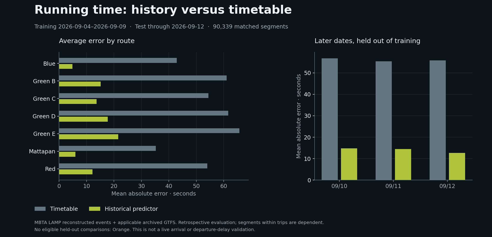

# LAMP running-time prediction study

Can recent observed segment times improve on the timetable for later service dates? This is a focused test of one reusable historical predictor, with a matched baseline and explicit abstention. It is useful for identifying where timetable running times and reconstructed operations differ before building a live prediction system.



In this retained run, the historical predictor's mean absolute error was **14.1 seconds**, compared with **56.0 seconds** for the timetable, on the same **90,339 held-out segments**. Its 90th-percentile absolute error was **29 seconds**, versus **95 seconds**. These are retrospective errors against LAMP reconstructed events, not independent validation of actual vehicle passage or live arrival accuracy.

## Data and exact matching

The run uses nine daily [MBTA LAMP subway exports](https://performancedata.mbta.com/), September 4–12, 2026. The [LAMP dictionary](https://github.com/mbta/lamp/blob/main/Data_Dictionary.md) describes reconstructed arrival, movement and running-time fields. The [performance-manager implementation](https://github.com/mbta/lamp/blob/main/src/lamp_py/performance_manager/README.md) explains how vehicle reports and trip updates contribute to reconstruction. Stop arrivals can use final predictions when vehicle-position events are absent; the exported target is not an independent sensor truth label.

Each date is matched to the applicable timetable in the [MBTA archive catalog](https://cdn.mbta.com/archive/archived_feeds.txt), following the [archive documentation](https://github.com/mbta/gtfs-documentation/blob/master/reference/gtfs-archive.md). This run used **Fall 2026, September 11 20:42:05 UTC, version D**, covering September 4–December 12. The catalog links to the archive at `cdn.mbtace.com`; that host is an explicit source in the adapter. Published URLs, sizes, last-modified times, service dates and archive versions are retained in the result.

Matches require the service date, trip ID, route, direction, ordered stop sequence, and adjacent stop pair to agree with archived GTFS. Calendar additions and removals apply. GTFS sequence numbers need not be consecutive integers. Duplicate stop sequences exclude the entire ambiguous trip instance. Missing directions are not assigned a default. The LAMP scheduled travel time must equal the independently reconstructed archived duration. Missing, nonpositive and mismatched times are excluded; large positive running times are retained.

The exclusion ledger is disjoint at its main stages:

| Stage | Records |
| --- | ---: |
| Source stop rows | 384,580 |
| Excluded with ambiguous trip instances | 4,264 |
| Unmatched adjacent-stop rows, including first stops | 76,061 |
| Matched rows with unusable time comparisons | 2,486 |
| Eligible adjacent segments, training and test | 301,769 |

There were 728 duplicated stop rows within the excluded ambiguous instances. This is a diagnostic subcount, not an additional exclusion. No matched duration disagreed with the archive in this run. Per-route input, unmatched and eligible counts are in the result file.

## Method and holdout

Training uses September 4–9; evaluation uses September 10–12. For each exact route, direction and adjacent stop pair, compute a median running time within each training date, then the median of those daily medians. Require at least three training dates. This gives each training date equal influence on the fitted segment value. Entire later service dates are held out; evaluation targets cannot affect fitting.

Both predictors are evaluated on identical test rows. Of 90,348 eligible test segments, nine lack sufficient training history and are left unpredicted. The resulting 99.99% prediction coverage is **conditional on eligible matched segments**, not coverage of all source records, vehicles, routes or passengers.

| Held-out service date | Historical MAE | Timetable MAE | Scored segments |
| --- | ---: | ---: | ---: |
| September 10 | 14.8 s | 56.8 s | 32,649 |
| September 11 | 14.5 s | 55.4 s | 32,226 |
| September 12 | 12.7 s | 55.8 s | 25,464 |

Seven routes have scored comparisons: Blue, Red, Mattapan and Green B/C/D/E. Orange appears in the source/training material but has no eligible held-out comparisons; this study cannot assess its prediction accuracy. Absence from evaluation does not mean absence of operated service.

The historical predictor improves average error on each of the three test dates and seven scored routes. Its mean signed error, defined as reconstructed minus predicted running time, is +7.0 seconds; the timetable's is −46.4 seconds. The latter indicates that scheduled segment times exceeded reconstructed times on average in this sample. This does not measure departure punctuality: schedule padding, dwell, holding and downstream departure timing are separate questions.

## Limits and next experiment

The archive version includes a revision published during the evaluation period. The historical operations may also be revised after service. This is a **retrospective holdout**, not a simulation of information available to an online predictor at each event time. Source export timestamps are retained; a published file or a past date alone does not prove completeness. Use completed dates and inspect source coverage before interpreting a new run.

The model does not include time of day, weekday, holidays, dwell, crowding, disruptions, weather or a current vehicle state. The window is short and contains differing service days. Segments within one trip are dependent, so the 90,339 rows are not 90,339 independent experiments. No confidence interval, causal claim, passenger-weighted benefit or comparison with a commercial product is implied.

A useful next experiment is rolling evaluation over many complete service weeks, freezing both event and timetable versions as they were available at prediction time. Compare against a matched time-of-day baseline, report route/direction coverage and errors by trip and date, and separately validate targets against observed vehicle passages. The current study supplies the matching, abstention and evaluation path for that work.

## Use in Agency

Open **Skills → Running-time prediction review** to inspect the prepared result, daily error chart and route comparison. **Build a LAMP running-time study** accepts training start/end and evaluation end dates, plus an optional route. The same functions are reusable Ask tools: `historical_runtime` and `run_runtime_study`. An expensive study is an explicit action, not part of a routine briefing refresh.

The adapter is explicitly for MBTA's LAMP schema; the rest of Agency remains City-configured. Results belong to the selected City's research directory and identify their source as MBTA. They must not be applied to another agency just because its route names happen to match. The historical predictor supplies segment-time estimates, not current departure delay, an incident cause or a recovery forecast.

## Reproduce

Use a Python environment with `scripts/lamp/requirements.txt` installed. The normal Node application does not install or load those dependencies. Set `VIGO_AGENCY_PYTHON` to that environment's Python for the server skill.

```bash
python3 -m pip install -r scripts/lamp/requirements.txt
python3 scripts/lamp-runtime-study.py --start 2026-09-04 --train-end 2026-09-09 --end 2026-09-12 --output /path/to/city/.vigo/agency/lamp
python3 test/check-lamp-study.py
node test/check-lamp-reader.mjs
python3 scripts/plot-lamp-study.py artifacts/lamp/2026-09-04--2026-09-12.json docs/figures/lamp-runtime-study.png
```

The runner permits at most 31 dates, 100 MB of daily downloads, four archives, bounded file sizes and a ten-minute server deadline. Downloads are restricted to documented public source hosts, including redirects. No model-provided shell, URL or file path is executed. Cache filenames retain publication versions rather than treating an unchanged URL as immutable.

The [retained result](../artifacts/lamp/2026-09-04--2026-09-12.json) contains parameters, complete segment evaluations, exclusions and source provenance. Raw Parquet and GTFS archives remain in City storage. Each completed run keeps its report and per-row evaluation CSV in a dated `runs/` directory. The current `study.json` points to that run through `studyId` and `evaluationFile`; saved notes retain those identifiers and the complete source manifest. New or failed runs do not overwrite a previous run’s evidence. A rerun against revised upstream files can differ; compare its retained source versions before comparing errors.

The run used macOS 26.5.1 on arm64, Python 3.13.5, pandas 2.3.3, NumPy 2.3.4 and PyArrow 22.0.0. Matplotlib 3.10.7 rendered the figure. No LLM fits the predictor or calculates its errors. Codex assisted with implementation, tests and this technical record; the separately tested briefing investigation uses the configured local Qwen3.5 4B endpoint.
